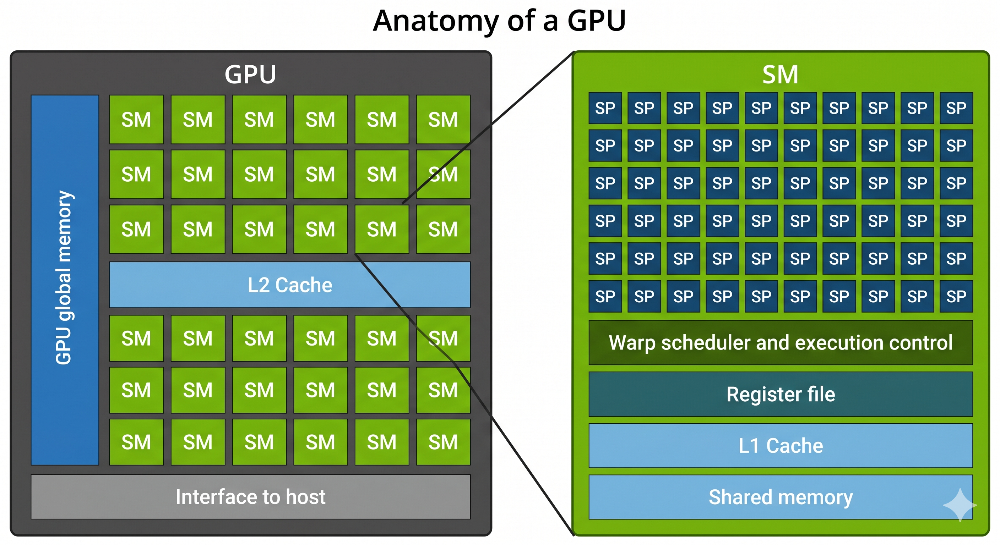
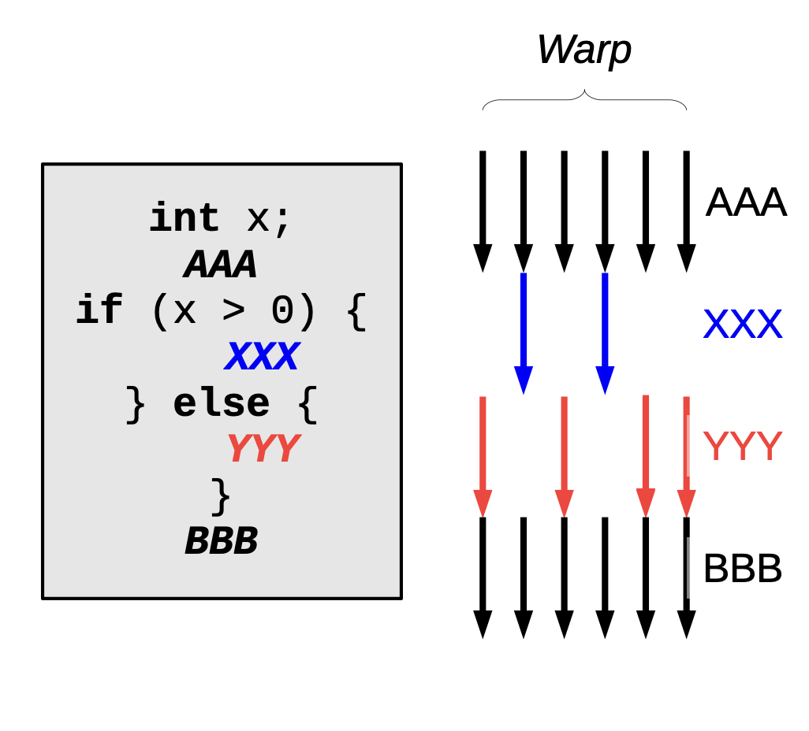
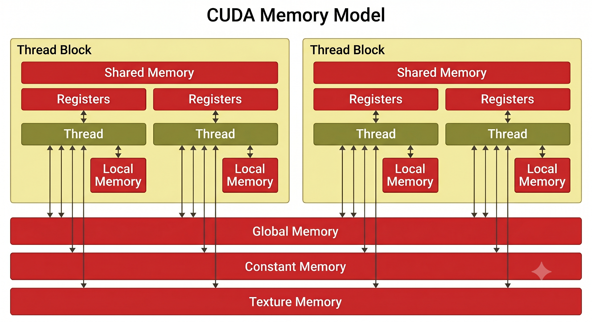

# Introduzione al Calcolo Parallelo su GPU e CUDA

Il calcolo ad alte prestazioni ha subito una vera e propria rivoluzione con l'introduzione delle GPU (Graphics Processing Unit) per scopi di calcolo generale. Mentre le CPU tradizionali sono progettate e ottimizzate per eseguire il più velocemente possibile singole sequenze di istruzioni (ottimizzazione della latenza) su pochi core, le GPU nascono per massimizzare il *throughput*, eseguendo simultaneamente migliaia di thread in parallelo per elaborare enormi moli di dati. 

Per programmare e sfruttare questo immenso parallelismo, sono nati modelli di programmazione specifici. Il più celebre e utilizzato è **CUDA** (Compute Unified Device Architecture), una piattaforma e un modello di programmazione introdotto da NVIDIA nel 2006.

## Il Modello Eterogeneo: Host e Device

La programmazione su GPU tramite CUDA si basa su un modello di calcolo "eterogeneo", nel quale due entità fisicamente separate lavorano in stretta sinergia: l'**Host** e il **Device**.

*   **Host**: Rappresenta la CPU (Central Processing Unit) e la sua memoria di sistema (la RAM del computer). L'Host funge da "direttore d'orchestra": esegue tutto il codice sequenziale tradizionale, gestisce le interazioni di I/O e decide quando è il momento di delegare le operazioni alla scheda video.
*   **Device**: Rappresenta la GPU e la sua memoria dedicata (VRAM). Lavora come un coprocessore ad altissime prestazioni. Quando riceve un comando dall'Host, il Device esegue la parte di codice parallelo (che in CUDA viene chiamata *kernel*) utilizzando le sue migliaia di core.

Il ciclo vitale di base di un'applicazione CUDA prevede che l'Host allochi memoria sul Device, vi copi i dati da elaborare, lanci in esecuzione il *kernel*, e infine attenda e ricopi i risultati elaborati dalla GPU per riportarli nella memoria della CPU.

## CUDA vs OpenCL: Pregi, Difetti e Diffusione

Nel panorama della programmazione su GPU, l'alternativa principale a CUDA è rappresentata da **OpenCL**, uno standard aperto sviluppato inizialmente da un consorzio di aziende (tra cui Apple, AMD, Intel e la stessa NVIDIA). 

Nonostante l'attrattiva di uno standard aperto, **CUDA gode oggi di un'adozione e una popolarità nettamente superiori nell'industria e nella ricerca**. 

### Perché CUDA domina su OpenCL?
Il motivo principale del predominio di CUDA è da ricercarsi nel miglior compromesso tra prestazioni e comodità per gli sviluppatori. CUDA C/C++ aggiunge solo un piccolo set di estensioni sintattiche al linguaggio C/C++ standard, mantenendo un'interfaccia di programmazione intuitiva e pulita. 
Al contrario, OpenCL è noto per avere una curva di apprendimento notevolmente più ripida: anche scrivere il programma più basilare richiede una comprensione complessa dell'architettura e la scrittura di molto codice accessorio ("boilerplate"). Inoltre, la promessa di portabilità di OpenCL è stata in parte frenata dal fatto che alcune sue implementazioni si sono rivelate meno efficienti (generando eseguibili anche fino al 30% più lenti rispetto all'equivalente codice CUDA) e talvolta affette da difetti o bug di sviluppo.

### Confronto riassuntivo

**CUDA**
*   **Pregi:** 
    *   Sintassi semplice, naturale estensione dello standard C/C++.
    *   Prestazioni eccellenti e garantite sull'hardware di riferimento.
    *   Ecosistema maturo con una suite ineguagliabile di librerie altamente ottimizzate (come cuBLAS per l'algebra lineare).
*   **Difetti:** 
    *   *Vendor lock-in*: essendo proprietario, un programma CUDA può girare unicamente su macchine dotate di GPU NVIDIA.

**OpenCL**
*   **Pregi:** 
    *   Portabilità e scalabilità estreme: essendo uno standard aperto, il medesimo codice può essere eseguito non solo su GPU di produttori diversi (NVIDIA, AMD, Intel), ma anche su CPU multi-core.
    *   Nessun vincolo tecnologico verso un singolo fornitore hardware (*no vendor lock-in*).
*   **Difetti:** 
    *   Codice sorgente estremamente prolisso (*verbose*) e oggettivamente complesso da apprendere e mantenere per un principiante.
    *   Adozione rallentata dal supporto incostante dei vari vendor; le prestazioni possono variare imprevedibilmente passando da un hardware all'altro.


## Il Flusso di Elaborazione (Processing Flow) su GPU

L'esecuzione di un programma su architettura CUDA prevede una stretta interazione tra la CPU (Host) e la GPU (Device), le quali possiedono spazi di memoria fisicamente separati. L'intero ciclo di vita di un'elaborazione su GPU si può riassumere in un flusso logico (Simple Processing Flow) composto da tre fasi principali:

### 1. Trasferimento dei dati in ingresso (Host to Device)
Poiché la GPU opera sui propri banchi di memoria, il primo passo spetta all'Host. La CPU alloca lo spazio necessario nella memoria globale della GPU (generalmente utilizzando la funzione `cudaMalloc`) e vi copia i dati da elaborare. Questo trasferimento fisico dei dati dalla memoria di sistema alla memoria del Device avviene viaggiando attraverso il bus PCI Express, utilizzando il comando `cudaMemcpy` e specificando la direzione `cudaMemcpyHostToDevice`.

### 2. Esecuzione del programma GPU (Kernel)
Una volta che i dati sono presenti e pronti sulla scheda video, la CPU carica e lancia l'esecuzione del programma parallelo sulla GPU, noto come *kernel*. Durante questa fase:
* L'hardware della GPU prende il controllo e suddivide il lavoro su migliaia di thread.
* Per massimizzare le prestazioni ed evitare continui e lenti accessi alla memoria globale, è bene ottimizzare l'accesso ai dati all'interno del chip, sfruttando memorie ultra-veloci come i registri privati e la memoria condivisa (Shared Memory).
* Il lancio del kernel è **asincrono**: il controllo ritorna immediatamente alla CPU, che può proseguire con altre operazioni oppure mettersi in attesa del completamento del kernel richiamando `cudaDeviceSynchronize()`.

### 3. Recupero dei risultati (Device to Host)
Al termine dell'elaborazione, i dati risultanti risiedono ancora nella memoria del Device. Affinché il programma principale possa utilizzarli, salvarli o stamparli, la CPU deve inviare un nuovo comando di copia. Si utilizza nuovamente `cudaMemcpy`, ma con direzione inversa (`cudaMemcpyDeviceToHost`), per copiare i risultati dalla memoria della GPU a quella della CPU, transitando sempre sul bus PCIe.

Come operazione finale di pulizia (Cleanup), la memoria precedentemente allocata sulla GPU deve essere liberata invocando la funzione `cudaFree()`.


# Anatomia di una GPU e Gerarchia di Memoria

A differenza di una CPU tradizionale, progettata per eseguire poche istruzioni complesse con bassissima latenza, una GPU è costruita con l'obiettivo di massimizzare il *throughput* parallelo. Per ottenere questo risultato, la GPU sacrifica complesse unità di controllo (come il *branch predictor* o l'esecuzione fuori ordine) in favore di un numero enorme di unità di calcolo.

## Componenti Principali

L'architettura hardware di una GPU (in particolare nel mondo NVIDIA/CUDA) si basa su una struttura altamente gerarchica:

*   **Streaming Multiprocessor (SM):** È il cuore computazionale della GPU (spesso chiamato *Compute Unit* in terminologia OpenCL). Una GPU è composta da un array (una griglia) di numerosi SM.
*   **Streaming Processor (SP) o CUDA Core:** All'interno di ogni singolo SM si trovano dozzine o centinaia di piccoli processori (ALU). Questi core eseguono materialmente i calcoli matematici.
*   **Warp Scheduler e Unità di Controllo:** I core all'interno di un SM non sono totalmente indipendenti, ma raggruppano i thread in unità da 32 chiamate *warp*, condividendo la logica di *fetch* e *decode* delle istruzioni. 
*   Ogni SM è inoltre dotato di veloci risorse fisiche condivise, tra cui un imponente **Register File** (banco dei registri) e memorie cache L1 e condivise.

## I Tipi di Memoria (Gerarchia)

Il modello di memoria di CUDA prevede spazi di memoria distinti, caratterizzati da diverse latenze, larghezze di banda e visibilità da parte dei thread. Procedendo dalla più veloce alla più lenta:

1.  **Registri (Registers):** Costituiscono la memoria più veloce in assoluto (on-chip). Sono rigorosamente privati per ogni singolo thread e vengono usati per memorizzare le variabili locali ad accesso più frequente.
2.  **Memoria Condivisa (Shared Memory):** È una memoria on-chip estremamente veloce (paragonabile alla cache L1) la cui allocazione e utilizzo devono essere esplicitamente gestiti dal programmatore nel codice. È visibile esclusivamente ai thread che appartengono allo stesso **blocco**, permettendo loro di cooperare e condividere risultati intermedi senza dover accedere alla memoria esterna.
3.  **Memoria Locale (Local Memory):** Questa memoria è privata per il singolo thread, ma fisicamente risiede nell'enorme e lenta memoria esterna del *Device* (DRAM). Viene utilizzata automaticamente dal compilatore quando un thread esaurisce i registri a disposizione (fenomeno di *register spilling*) o per allocare array locali troppo grandi.
4.  **Memoria Globale (Global Memory):** È lo spazio di memoria più capiente della GPU (misurabile in Gigabyte), accessibile in lettura e scrittura da *tutti* i thread di qualsiasi blocco, oltre che dall'Host (tramite bus PCIe). Tuttavia, è "off-chip", il che comporta latenze molto elevate (centinaia di cicli di clock). L'accesso a questa memoria dovrebbe sempre essere ottimizzato tramite accessi "coalescenti" per sfruttare la banda passante.
5.  **Memoria Costante (Constant Memory) e Texture Memory:** Sono porzioni specifiche della lenta memoria globale che godono però di **cache hardware dedicate on-chip**. Sono accessibili in sola lettura da parte dei thread della GPU (possono essere scritte solo dall'Host). La memoria costante è ottimizzata per distribuire in un colpo solo lo stesso valore a tutto un *warp* di thread, mentre la Texture Memory è ottimizzata per sfruttare la località spaziale 2D, rivelandosi utile in specifici pattern di accesso.



# Il Modello di Programmazione CUDA: Griglie, Blocchi e Thread

Per sfruttare l'enorme parallelismo delle GPU, CUDA richiede al programmatore di adottare una specifica astrazione gerarchica. Invece di scrivere un programma sequenziale, il programmatore deve pensare a come scomporre il dominio del problema in porzioni indipendenti e via via più piccole. 

Questa astrazione si articola sui seguenti livelli:

### 1. Il Problema Globale (La Griglia / Grid)
Quando il programmatore lancia un *kernel* sulla GPU, crea un'entità chiamata **Grid** (Griglia). La griglia rappresenta l'intero problema computazionale da risolvere (ad esempio, l'elaborazione di un'intera immagine o la moltiplicazione di due grandi matrici). Una griglia può essere monodimensionale (1D), bidimensionale (2D) o tridimensionale (3D), a seconda della topologia dei dati da elaborare.

### 2. Sottoproblemi Indipendenti (I Blocchi / Thread Blocks)  
La griglia è a sua volta suddivisa in numerosi Blocchi. Ogni blocco è un raggruppamento di thread che elabora una specifica e circoscritta porzione del problema globale (ad esempio, un tassello 16x16 pixel dell'immagine). La divisione in blocchi è il segreto della Scalabilità Automatica di CUDA: l'hardware è libero di eseguire questi blocchi in qualsiasi ordine, in parallelo o sequenzialmente
. Se l'utente esegue il programma su una GPU economica con soli 2 Streaming Multiprocessor (SM), i blocchi verranno elaborati un po' alla volta, distribuiti sulle poche risorse disponibili; se usa una GPU di fascia alta con decine di SM, molti più blocchi verranno elaborati in contemporanea, riducendo drasticamente il tempo di esecuzione senza dover modificare una singola riga di codice
. Proprio per questo il programmatore mira a scrivere un programma cosiddetto longevo: suddividendo il problema in moltissimi blocchi indipendenti, si assicura che man mano che saranno disponibili GPU future più potenti, lo stesso codice potrà scalare automaticamente ed essere eseguito in un minor tempo.


### 3. L'Unità Minima Logica (I Thread)
Ogni blocco è composto da una matrice di **Thread**, che rappresentano l'unità minima logica di lavoro. Ciascun thread esegue la medesima sequenza di istruzioni (il *kernel*), ma applicata a un singolo elemento dei dati, calcolando il proprio indirizzo in memoria sfruttando le coordinate fornite dal sistema (`threadIdx` e `blockIdx`). Le dimensioni di un blocco sono decise dal programmatore, ma l'architettura impone un limite massimo invalicabile di 1024 thread per blocco. All'interno dello stesso blocco, i thread possono cooperare e scambiarsi dati velocemente tramite la memoria condivisa (Shared Memory).

### 4. L'Esecuzione Fisica (I Warp)
Mentre Griglia, Blocchi e Thread sono le astrazioni *logiche* usate dal programmatore per scrivere il codice, a livello *hardware* l'esecuzione avviene tramite un'ulteriore suddivisione: i **Warp**.
Quando un blocco viene assegnato a un multiprocessore (SM), l'hardware raggruppa automaticamente i suoi thread in gruppi indivisibili di **32 thread**, chiamati appunto Warp. Tutti i 32 thread di un warp operano in rigoroso regime SIMT (Single-Instruction, Multiple-Thread): eseguono contemporaneamente la stessa identica istruzione ma su dati diversi. Questo permette di semplificare enormemente i circuiti di controllo della GPU, sacrificando però efficienza qualora i thread dello stesso warp debbano prendere percorsi condizionali diversi (fenomeno noto come *thread divergence*).

Il vantaggio nell'utilizzo di tali astrazioni risiede nel fatto che, in questo modo, è possibile gestire la topologia di domini dati ricorrenti (come vettori 1D, immagini 2D o volumi 3D) in maniera semplice e naturale. Tuttavia, questa architettura richiede al programmatore una maggiore attenzione nel calcolo matematico per l'indicizzazione globale di thread e blocchi, al fine di evitare accessi in aree di memoria non consentite.


# Efficienza dei Warp e Divergenza dei Thread

L'architettura alla base delle GPU moderne è definita **SIMT** (Single-Instruction, Multiple-Thread). In questo modello, gli streaming multiprocessor (SM) creano, gestiscono ed eseguono i thread raggruppandoli in unità fisiche indivisibili da **32 thread**, chiamate **warp**.

Per come è progettato l'hardware, un warp può emettere e processare una singola istruzione alla volta. Pertanto, **l'efficienza massima e il pieno utilizzo delle risorse hardware si ottengono esclusivamente quando tutti e 32 i thread di un warp eseguono simultaneamente la stessa identica istruzione**, operando in rigoroso *lockstep*. In questa condizione ideale, nessuna pipeline di calcolo viene sprecata.

Tuttavia, ogni singolo thread possiede un proprio program counter e un proprio stato dei registri, il che gli permette di valutare in autonomia condizioni logiche e prendere percorsi di codice differenti. Quando all'interno del kernel si incontra un'istruzione condizionale dipendente dai dati (come un costrutto `if/then/else`), alcuni thread del medesimo warp potrebbero dover seguire il ramo logico del `then`, mentre altri potrebbero dover eseguire l' `else`. Questa situazione prende il nome di **divergenza dei thread** (*thread divergence*).

Poiché l'hardware del warp non è in grado di eseguire due istruzioni diverse nello stesso istante, la GPU è costretta a risolvere la divergenza **serializzando l'esecuzione**. Il multiprocessore eseguirà sequenzialmente ogni singolo ramo: mentre viene elaborato il percorso di una parte dei thread, i thread che non appartengono a quel ramo vengono momentaneamente **disabilitati e costretti all'attesa**. Questo comportamento fa sì che, per tutta la durata dell'istruzione divergente, una porzione delle unità di calcolo rimanga inattiva e non utilizzata, annullando di fatto il beneficio del parallelismo. Solo una volta terminata l'esecuzione di tutti i percorsi ramificati, i thread del warp si ricongiungono e riprendono a eseguire l'istruzione successiva in piena simultaneità.



# L'Obiettivo del Programmatore: Ottimizzare l'Uso dei Registri

Nella stesura di un programma CUDA, l'hardware ci mette a disposizione un parallelismo imponente, consentendoci di lanciare blocchi che possono contenere fino a un massimo di 1024 thread. Il nostro obiettivo primario come programmatori è proprio quello di **sfruttare appieno questa potenza, riuscendo a far girare tutti e 1024 i thread di un blocco in modo efficiente e simultaneo**. 

Tuttavia, bisogna scontrarsi con una regola fondamentale dell'hardware CUDA: l'allocazione delle risorse per un blocco segue la logica del **"tutto o niente"**. Quando un blocco viene assegnato a uno Streaming Multiprocessor (SM), l'hardware deve riservare i veloci registri privati e la memoria condivisa per *tutti* i thread del blocco in un colpo solo. Il sistema non disattiverà mai alcun thread per cercare di "fare spazio" a un blocco troppo grande.

### Il Rischio: Fallimento del Kernel e Register Spilling
L'ostacolo principale a questo obiettivo si presenta quando scriviamo il codice (il *kernel*) in modo troppo complesso, definendo un numero eccessivo di variabili locali per il singolo thread. Se moltiplichiamo queste variabili per i 1024 thread del nostro blocco, potremmo superare rapidamente la disponibilità fisica dei registri sul multiprocessore.

Se il fabbisogno di memoria del blocco supera le risorse fisiche dell'SM, andiamo incontro a due scenari che distruggono le prestazioni:
1. **Fallimento del Kernel:** Se le risorse non sono sufficienti per ospitare nemmeno un singolo blocco per intero, l'esecuzione fallisce e il programma non viene lanciato.
2. **Register Spilling:** Per evitare il crash, il compilatore tenta di minimizzare l'uso dei registri trasferendo (o "versando") in automatico le variabili in eccesso nella *Local Memory*. Sebbene il blocco riesca a girare, la Local Memory risiede fisicamente nella lentissima memoria globale esterna, e questo causa un crollo drastico della velocità di calcolo di tutti i nostri 1024 thread.

### L'Accortezza del Programmatore
Per questo motivo, programmare in CUDA richiede un'estrema attenzione alla gestione della memoria locale. Il programmatore non può limitarsi a scrivere codice funzionante, ma deve adottare ogni accortezza possibile per **mantenere il singolo thread il più "leggero" possibile**. 

Riducendo al minimo indispensabile le variabili locali definite nel codice e riutilizzando i registri, il programmatore si assicura che il fabbisogno totale del blocco non ecceda i limiti dell'SM. Solo attraverso questa meticolosa ottimizzazione possiamo raggiungere il nostro vero traguardo: garantire che il multiprocessore riesca a ospitare i nostri blocchi da 1024 thread interamente nelle sue memorie ultra-veloci, sfruttando fino all'ultima goccia la potenza di calcolo della GPU.


# Funzioni Global, il Concetto di Kernel e la Gestione dei Dati

Nella programmazione CUDA, il codice che viene materialmente eseguito sulla GPU prende il nome di **kernel**. A differenza di una normale funzione C/C++ che viene elaborata una sola volta e in modo sequenziale, un kernel è progettato per essere eseguito simultaneamente in parallelo da decine di migliaia di thread indipendenti.

Per definire un kernel e istruire il compilatore (`nvcc`) a trattarlo come tale, CUDA estende il linguaggio C/C++ introducendo un qualificatore di spazio di esecuzione specifico: **`__global__`**.

### Il qualificatore `__global__`
Aggiungere la parola chiave `__global__` prima della definizione di una funzione stabilisce le seguenti regole architetturali:

1. **Esecuzione e Chiamata:** L'intero blocco di codice della funzione viene compilato ed eseguito fisicamente sui processori del *Device* (GPU), ma **l'invocazione avviene da parte della CPU (*Host*)**. Questo rappresenta il momento esatto in cui l'Host cede il controllo dell'operazione e sposta il carico computazionale sul Device.
2. **Perché restituisce sempre `void`?:** Le funzioni `__global__` devono avere obbligatoriamente un tipo di ritorno `void`. Questo limite deriva da due motivi fondamentali strettamente legati all'architettura hardware e alla memoria:
   * **Parallelismo massivo:** Il kernel viene eseguito in parallelo da innumerevoli thread. Se la funzione utilizzasse un comando `return`, la CPU riceverebbe migliaia di valori di ritorno simultanei, rendendo impossibile gestire o capire a quale specifico thread appartenga un dato risultato.
   * **Spazi di memoria separati:** Host (CPU) e Device (GPU) possiedono RAM fisicamente distinte. Un semplice `return` non avrebbe modo di trasferire automaticamente un dato dalla VRAM della scheda video alla RAM di sistema.

### Il meccanismo dei Puntatori e dell'Allocazione
Per ovviare all'impossibilità di usare il `return`, i risultati dell'elaborazione vengono salvati scrivendoli direttamente in aree di memoria della GPU. Il flusso di lavoro che il programmatore deve orchestrare è il seguente:

* **Allocazione:** Prima di lanciare il kernel, l'Host utilizza il comando `cudaMalloc()` per riservare lo spazio necessario ad ospitare i risultati direttamente nella memoria della scheda video.
* **Passaggio dei riferimenti:** L'Host lancia la funzione `__global__` passandole come argomenti i puntatori a quest'area di memoria pre-allocata sul Device. In questo modo, le migliaia di thread sanno esattamente in quale area della GPU scrivere i propri risultati finali.
* **Recupero:** Terminata l'elaborazione, la funzione `__global__` si chiude senza restituire nulla (`void`). I dati risiedono ora nell'area puntata della GPU. La CPU dovrà quindi invocare esplicitamente un comando `cudaMemcpy()` (con direzione `cudaMemcpyDeviceToHost`) per ricopiare i risultati dalla scheda video alla propria RAM, rendendoli fruibili.

### Il lancio del Kernel (Kernel Launch)
Essendo una funzione speciale, un kernel `__global__` non può essere chiamato con la normale sintassi del C/C++. Affinché la GPU sappia quanti thread attivare, il programmatore deve specificare la **configurazione di esecuzione**.

Questa configurazione si esprime inserendo il numero di griglie e di blocchi tra **tre parentesi angolari `<<< ... >>>`**, posizionate subito dopo il nome della funzione:

```cpp
// Definizione del kernel (ritorna void, usa puntatori per i risultati)
__global__ void mio_kernel(int *dati_input_device, int *risultati_device) {
    // Ogni thread calcola il proprio indice e scrive il risultato 
    // direttamente nell'area puntata da 'risultati_device'
}

int main() {
    // ... cudaMalloc e cudaMemcpy (Host to Device) per preparare i dati ...

    // Lancio del kernel: la chiamata parte dall'Host, l'esecuzione va sul Device
    mio_kernel<<<dimGrid, dimBlock>>>(dati_input_device); //dimGrid = Numero di Blocchi / dimBlock = Numero di Thread per Blocco

    // ... recupero dei risultati con cudaMemcpy (Device to Host) ...
}
```

Un aspetto cruciale da ricordare quando si lancia una `__global__` è la sua **asincronia**. Non appena la CPU esegue l'istruzione di lancio `<<<...>>>`, il controllo le viene restituito immediatamente, senza aspettare che la GPU finisca i calcoli. Se l'Host ha bisogno di attendere che il kernel termini il suo lavoro prima di procedere, dovrà invocare una barriera di sincronizzazione esplicita tramite il comando `cudaDeviceSynchronize()` (oppure attendere l'esecuzione di un `cudaMemcpy` bloccante, che implicitamente aspetta la fine delle operazioni precedenti).

Ecco il codice completo per l'esempio classico della **somma vettoriale** (somma di due array elemento per elemento), che mette in pratica tutti i concetti che abbiamo visto finora: la definizione del kernel `__global__`, l'allocazione della memoria sulla GPU, il trasferimento dei dati e il lancio dell'esecuzione parallela. 

```cpp
#include <stdio.h>
#include <stdlib.h>

// Definiamo la dimensione del problema e il numero di thread per blocco
#define N 512
#define THREADS_PER_BLOCK 256

// ---------------------------------------------------------
// 1. IL KERNEL (Eseguito sulla GPU, chiamato dalla CPU)
// ---------------------------------------------------------
__global__ void add(int *a, int *b, int *c, int n) {
    // Ogni thread calcola il proprio indice globale univoco
    int index = threadIdx.x + blockIdx.x * blockDim.x;

    // Controllo per evitare accessi oltre la fine dell'array
    if (index < n) {
        c[index] = a[index] + b[index];
    }
}

// ---------------------------------------------------------
// 2. IL PROGRAMMA PRINCIPALE (Eseguito sulla CPU)
// ---------------------------------------------------------
int main(void) {
    int *a, *b, *c;           // Puntatori per la memoria dell'Host (CPU)
    int *d_a, *d_b, *d_c;     // Puntatori per la memoria del Device (GPU)
    int size = N * sizeof(int);

    // Allocazione dello spazio per le copie sull'Host e inizializzazione
    a = (int *)malloc(size);
    b = (int *)malloc(size);
    c = (int *)malloc(size);
    for(int i = 0; i < N; i++) { 
        a[i] = 1; 
        b[i] = 2; 
    }

    // FASE 1: Allocazione della memoria sulla GPU
    cudaMalloc((void **)&d_a, size);
    cudaMalloc((void **)&d_b, size);
    cudaMalloc((void **)&d_c, size);

    // Trasferimento dei dati in ingresso (Host to Device)
    cudaMemcpy(d_a, a, size, cudaMemcpyHostToDevice);
    cudaMemcpy(d_b, b, size, cudaMemcpyHostToDevice);

    // FASE 2: Configurazione ed Esecuzione del Kernel
    // Calcoliamo quanti blocchi ci servono per coprire tutti gli N elementi
    int blocksPerGrid = (N + THREADS_PER_BLOCK - 1) / THREADS_PER_BLOCK;

    // Lancio del kernel in modo asincrono
    add<<<blocksPerGrid, THREADS_PER_BLOCK>>>(d_a, d_b, d_c, N);

    // FASE 3: Recupero dei risultati (Device to Host)
    cudaMemcpy(c, d_c, size, cudaMemcpyDeviceToHost);

    // Operazione finale: Pulizia della memoria sulla GPU e sulla CPU
    cudaFree(d_a); 
    cudaFree(d_b); 
    cudaFree(d_c);
    free(a); 
    free(b); 
    free(c);

    return 0;
}
```

### Analisi dei passaggi chiave:

1. **Gestione della Memoria (Fasi 1 e 3):** Come puoi notare nel `main`, l'Host non può passare i propri puntatori `a`, `b` e `c` alla GPU. Utilizza invece **`cudaMalloc`** per creare aree di memoria fisicamente separate sul Device (`d_a`, `d_b`, `d_c`). I dati vengono spostati con **`cudaMemcpy`**, specificando se il viaggio è verso la GPU (`cudaMemcpyHostToDevice`) o verso la CPU per recuperare i risultati (`cudaMemcpyDeviceToHost`).
2. **Il Lancio del Kernel e l'Asincronia:** L'istruzione `add<<<blocksPerGrid, THREADS_PER_BLOCK>>>(...)` dice alla GPU di attivare una griglia composta da blocchi, ciascuno contenente 256 thread. Poiché potremmo avere vettori di dimensioni arbitrarie che non sono multipli esatti della dimensione del blocco, la formula `(N + THREADS_PER_BLOCK - 1) / THREADS_PER_BLOCK` assicura di creare abbastanza blocchi per coprire tutti gli elementi. Infatti se `N` è multiplo di `THREADS_PER_BLOCK`, la formula restituisce il risultato `N/THREADS_PER_BLOCK`, in caso contrario è come se prendesse la parte intera superiore, cioè alloca un blocco di `THREADS_PER_BLOCK` thread, ma alcuni di questi non verranno utilizzati.
3. **Astrazione e Indicizzazione nel Kernel:** Poiché decine di migliaia di thread eseguiranno la stessa funzione `add`, l'unico modo che ha un thread per sapere su quale elemento dell'array deve lavorare è calcolare la propria coordinata spaziale. L'istruzione **`int index = threadIdx.x + blockIdx.x * blockDim.x;`** permette a ogni thread di trovare il proprio posto nel problema globale. L'istruzione `if (index < n)` protegge la memoria, assicurandosi che i thread in eccesso creati nell'ultimo blocco non cerchino di scrivere fuori dai limiti dell'array.


# La Gerarchia di Memoria della GPU e il Limite delle Risorse

Le moderne GPU possiedono una gerarchia di memoria complessa, essenziale per gestire l'enorme mole di dati elaborata in parallelo. A differenza delle CPU, che si affidano a grandi cache gestite dall'hardware per ridurre la latenza, le GPU offrono diversi spazi di memoria, molti dei quali devono essere gestiti esplicitamente dal programmatore per ottenere le massime prestazioni.

Ecco i tipi di memoria a disposizione di un thread CUDA:

*   **Registri (Registers):** È la memoria più veloce in assoluto (on-chip), con un tempo di accesso di 1 solo ciclo di clock. I registri sono rigorosamente privati per ogni singolo thread e contengono le variabili locali ad accesso frequente. Le GPU dispongono di decine di migliaia di registri per ogni Streaming Multiprocessor (SM), ripartiti tra i thread attivi.
*   **Memoria Condivisa (Shared Memory):** È una memoria on-chip estremamente veloce (1-32 cicli di clock) allocata per blocco. Tutti i thread dello stesso blocco possono leggere e scrivere in questo spazio, rendendolo ideale per la cooperazione e la sincronizzazione. Funge di fatto come una cache gestita dall'utente (*user-managed cache*), permettendo di caricare dati dalla memoria globale, elaborarli e riscriverli, evitando continui accessi lenti. La sua quantità è però limitata (es. da 16 KB a 48 KB per SM a seconda dell'architettura).
*   **Memoria Globale (Global Memory):** È lo spazio di memoria più capiente (fino a svariati Gigabyte, risiede nella DRAM off-chip) ma anche il più lento, con latenze che possono raggiungere centinaia di cicli di clock. È visibile a tutti i thread dell'applicazione e all'Host (CPU). Per massimizzare la banda passante, gli accessi a questa memoria devono essere **coalescenti**: i thread di un *warp* dovrebbero accedere ad indirizzi di memoria contigui, in modo che l'hardware raggruppi le richieste in un'unica transazione da 32, 64 o 128 byte.
*   **Memoria Costante (Constant Memory):** È una porzione della memoria globale, accessibile in sola lettura dal device (e in scrittura dall'Host). Pur essendo off-chip, gode di una cache dedicata ad altissima velocità. È ottimizzata per fare *broadcasting*: se tutti i thread di un warp leggono lo stesso identico indirizzo costante, il dato viene fornito in un singolo ciclo.
*   **Memoria per Texture e Superfici (Texture/Surface Memory):** Come la memoria costante, risiede off-chip ma possiede una cache dedicata. È ottimizzata specificamente per la **località spaziale bidimensionale (2D) e tridimensionale (3D)**: i thread che accedono a coordinate geometricamente vicine otterranno prestazioni eccellenti (molto usata nella grafica e nell'elaborazione di immagini).
*   **Memoria Locale (Local Memory):** Nonostante il nome possa trarre in inganno, questa memoria **risiede fisicamente nella lentissima memoria globale off-chip**. Viene utilizzata automaticamente dal compilatore come spazio privato per il singolo thread quando le variabili allocate sono troppo grandi per stare nei registri (es. array indicizzati con variabili) o quando i registri fisici dell'SM si esauriscono. Questo fenomeno prende il nome di **register spilling**.



---

### Il compromesso tra Memoria Allocata, Dimensioni del Blocco e Prestazioni

Come programmatori CUDA, il nostro obiettivo è massimizzare l'**Occupancy**, ovvero il numero di *warp* attivi contemporaneamente sull'SM. La GPU ha un disperato bisogno di mantenere in esecuzione decine di warp simultaneamente per poter utilizzare la tecnica dell'**occultamento della latenza** (*latency hiding*): mentre un warp aspetta centinaia di cicli di clock per ricevere un dato dalla memoria globale, l'hardware esegue istantaneamente i calcoli di un altro warp pronto.

Tuttavia, il numero di blocchi e di warp che possono risiedere fisicamente sull'SM dipende dalla quantità di **registri e di memoria condivisa** richiesti dal singolo kernel.

**Cosa succede quando si alloca troppa memoria per singolo thread?**
Se nel nostro codice definiamo un kernel molto complesso, ricco di variabili locali o pesanti array per ogni thread, la richiesta totale di registri o di memoria privata per un intero blocco (es. un blocco da 1024 thread) potrebbe superare le disponibilità fisiche dell'SM. L'hardware non ha modo di dividere a metà un blocco: l'allocazione avviene per tutto il blocco simultaneamente.

In questa situazione critica, si verificano i seguenti problemi prestazionali a catena:

1.  **Impossibilità di lanciare il Kernel o Spilling:** Se il blocco richiede troppe risorse, il kernel fallirà semplicemente il lancio. Per evitare il crash, il compilatore ripiegherà sul *register spilling*, scaricando le variabili in eccesso nella lentissima memoria locale (DRAM esterna), affossando istantaneamente le prestazioni.
2.  **Necessità di diminuire i Thread per Blocco:** Per ovviare al problema (quando non è possibile semplificare il codice), **il programmatore è costretto a riconfigurare il lancio del kernel, diminuendo il numero di thread assegnati a ciascun blocco** (ad esempio, passando da 1024 a 256 o 128 thread per blocco) per far rientrare il consumo totale di memoria entro i limiti fisici dell'SM.
3.  **Crollo dell'Occupancy e della Potenza di Calcolo:** Configurando blocchi con pochi thread, si abbassa drasticamente l'occupancy dell'SM. Avendo a disposizione un numero insufficiente di *warp* concorrenti, lo scheduler della GPU non avrà abbastanza thread da far lavorare mentre gli altri sono in attesa dei dati dalla memoria. 

Di conseguenza, a causa dell'eccessiva allocazione di memoria per singolo thread, **la GPU rimarrà in idle (inattiva) per lunghi periodi, non sfruttando a pieno i suoi core computazionali e vanificando l'enorme potenza di calcolo parallelo per cui è stata progettata**.


# L'Utilità dei Thread: Stencil 1D

Fino a questo momento potremmo chiederci: perché complicarci la vita con i thread? Se la GPU può gestire migliaia di blocchi in modo automatico, non potremmo semplicemente lanciare tantissimi blocchi composti da un solo thread ciascuno? 

Sebbene in alcuni scenari banali (come la semplice somma di due vettori) questo approccio possa funzionare, in molti problemi reali risulterebbe disastroso. A differenza dei blocchi (che sono completamente indipendenti e isolati), **i thread all'interno dello stesso blocco possiedono due meccanismi fondamentali: possono comunicare tra loro e possono sincronizzarsi**. 

Per capire quanto questi due superpoteri rendano i thread superiori a un approccio "a blocchi singoli", analizziamo il classico algoritmo dello **Stencil 1D**.

### Il Problema: Letture multiple e il collo di bottiglia
Lo Stencil 1D è un'operazione in cui ogni elemento di un array di output viene calcolato come la somma (o una media) degli elementi dell'array di input compresi entro un certo `RADIUS` (raggio). Se il raggio è 3, ogni elemento in uscita richiederà la lettura di 7 elementi in ingresso (i 3 a sinistra, l'elemento stesso, e i 3 a destra).
Più in generale, con un raggio $R$, **ogni singolo dato in input viene letto dalla memoria per ben $(2R+1)$ volte**.

Se affrontassimo questo problema usando blocchi da 1 singolo thread, ogni thread dovrebbe leggere i suoi 7 elementi direttamente dalla lenta Memoria Globale. Poiché i thread di blocchi diversi non possono parlarsi, le letture si sovrapporrebbero in continuazione, intasando la banda passante della memoria globale e creando un enorme collo di bottiglia.

### La Soluzione: Memoria Condivisa (Comunicazione)
Raggruppando più thread all'interno dello stesso blocco, possiamo sfruttare la **Memoria Condivisa (Shared Memory)**. Si tratta di una memoria ultra-veloce integrata direttamente nel chip del multiprocessore, che funge da cache gestita manualmente dal programmatore. 

Invece di far leggere a ogni thread gli stessi dati dalla memoria globale, possiamo far **cooperare i thread del blocco**:
1. Ognuno dei thread (`blockDim.x` in totale) legge esattamente un solo elemento dalla memoria globale e lo salva nella memoria condivisa.
2. I primi `RADIUS` thread del blocco si fanno carico di un piccolo lavoro extra: leggere anche i dati di bordo (il cosiddetto "alone" o *halo*) necessari per i calcoli ai margini del blocco.

In questo modo, abbiamo trasferito un intero segmento di dati (più i bordi) dalla lenta memoria globale alla velocissima memoria condivisa con un numero minimo di transazioni.

### Il Rischio: Data Race e la necessità di Sincronizzazione
Questa cooperazione introduce però un problema critico di temporizzazione. Poiché i warp e i thread vengono eseguiti con tempistiche leggermente diverse, cosa succede se il thread numero 15 tenta di eseguire il calcolo matematico dello stencil *prima* che il thread 0 abbia finito di scaricare il proprio pezzo di "alone" nella memoria condivisa? 
Si verifica un **Data Race** (condizione di corsa): il thread 15 leggerebbe un dato sporco o inesistente, portando a calcoli completamente errati.

Qui entra in gioco il secondo superpotere dei thread: la funzione barriera **`__syncthreads()`**. Questa istruzione blocca l'esecuzione di ogni thread del blocco finché *tutti* gli altri thread non l'hanno raggiunta. 

### Il Kernel Funzionante
Ecco come i due concetti si uniscono in un codice efficiente ed elegante:

```cpp
__global__ void stencil_1d(int *in, int *out) {
    // 1. Alloco la memoria condivisa (Dimensione blocco + i due aloni ai bordi)
    __shared__ int temp[BLKDIM + 2 * RADIUS];
    
    int gindex = threadIdx.x + blockIdx.x * blockDim.x + RADIUS;
    int lindex = threadIdx.x + RADIUS;
    
    // 2. I thread cooperano per copiare i dati dalla memoria globale a quella condivisa
    temp[lindex] = in[gindex];
    if (threadIdx.x < RADIUS) {
        temp[lindex - RADIUS] = in[gindex - RADIUS]; // Halo sinistro
        temp[lindex + blockDim.x] = in[gindex + blockDim.x]; // Halo destro
    }
    
    // 3. SINCRONIZZAZIONE: Nessuno procede finché tutta la memoria condivisa non è pronta!
    __syncthreads(); 
    
    // 4. Calcolo dello stencil usando SOLO la velocissima memoria condivisa
    int result = 0;
    for (int offset = -RADIUS ; offset <= RADIUS ; offset++) {
        result += temp[lindex + offset]; 
    }
    
    // 5. Scrittura del risultato
    out[gindex] = result;
}
```

In sintesi, **senza la possibilità di racchiudere i thread nello stesso blocco, non potremmo né dichiarare un'area di memoria visibile a tutti loro (`__shared__`), né potremmo sincronizzarli con `__syncthreads()` per assicurare un caricamento dati cooperativo**. Questo dimostra perché l'astrazione basata sui thread è assolutamente vitale per scrivere codice GPU ad alte prestazioni.

# Misurare il Tempo di Esecuzione dei Kernel

Quando si vuole valutare le prestazioni di un programma CUDA misurandone il *wall-clock time*, è fondamentale ricordare che **le invocazioni dei kernel sono asincrone**. Non appena la CPU esegue l'istruzione di lancio, riprende istantaneamente il controllo passando all'istruzione successiva, senza aspettare che la GPU abbia effettivamente terminato il calcolo.

Se si posiziona un timer prima e subito dopo la chiamata al kernel, si finirebbe per misurare soltanto il tempo irrisorio impiegato dalla CPU per accodare il comando, e non il reale tempo di elaborazione della GPU.

Per ottenere una misurazione corretta, è **obbligatorio inserire una barriera di sincronizzazione esplicita** chiamando il comando `cudaDeviceSynchronize()` subito prima di fermare il cronometro. In questo modo si forza la CPU ad attendere la fine di tutte le operazioni sul Device.

Ecco lo schema corretto per prendere i tempi:

```cpp
#include "hpc.h" // o altre funzioni per il calcolo del tempo (es. omp_get_wtime)
// ...
double tstart, tend;

tstart = hpc_gettime();  // 1. Avvia il cronometro

mykernel<<<X, Y>>>();    // 2. Lancio asincrono del kernel

cudaDeviceSynchronize(); // 3. FONDAMENTALE: la CPU aspetta che la GPU finisca

tend = hpc_gettime();    // 4. Ferma il cronometro

printf("Tempo trascorso: %f secondi\n", tend - tstart);
```


# Il Qualificatore `__device__` e l'Inlining delle Funzioni

Mentre il qualificatore `__global__` serve a definire il *kernel* principale (chiamato dall'Host ed eseguito sul Device), un buon design del software richiede spesso la suddivisione del codice in sottomoduli. Per definire funzioni di supporto interne alla GPU, CUDA fornisce il qualificatore **`__device__`**.

### Caratteristiche delle funzioni `__device__`
Anteporre la parola chiave `__device__` alla definizione di una funzione indica al compilatore che essa:
1. **Viene eseguita esclusivamente sui processori della GPU** (Device).
2. **Può essere chiamata solo da un'altra funzione già in esecuzione sul Device** (ovvero da un kernel `__global__` o da un'altra funzione `__device__`).
3. **Può restituire un valore**: a differenza dei kernel (che sono obbligati a ritornare `void`), le funzioni `__device__` possono restituire regolarmente valori scalari o strutturati (es. `int`, `float`), permettendo di scrivere funzioni matematiche o di utilità nel modo a cui i programmatori C/C++ sono abituati.

È importante ricordare che i qualificatori `__global__` e `__device__` non possono mai essere applicati contemporaneamente alla stessa funzione.

Di seguito è riportato un classico esempio di utilizzo del qualificatore `__device__`. Creeremo una piccola funzione di supporto per calcolare il massimo tra due numeri in virgola mobile (`cuda_fmaxf`) e la richiameremo all'interno del nostro kernel principale.

```cpp
// 1. Funzione ausiliaria: eseguita SOLO sulla GPU e chiamata SOLO dalla GPU
// A differenza di un kernel, restituisce regolarmente un valore (float)
__device__ float cuda_fmaxf(float a, float b) {
    return (a > b ? a : b); 
}

// 2. Kernel principale: eseguito sulla GPU ma chiamato dall'Host (CPU)
__global__ void my_kernel(float *v, int n) {
    // Ogni thread calcola il proprio indice globale
    int i = threadIdx.x + blockIdx.x * blockDim.x;

    // Controllo dei limiti dell'array
    if (i < n) {
        // Il kernel chiama la funzione __device__. 
        // Grazie all'inlining, il compilatore sostituirà questa riga 
        // espandendo direttamente il codice di cuda_fmaxf al suo interno.
        v[i] = cuda_fmaxf(1.0f, v[i]);
    }
}
```

### L'assenza di Stack e i Vantaggi dell'Inlining
Nelle architetture CPU classiche, l'invocazione di una funzione ha un costo prestazionale (*overhead*): il sistema deve salvare lo stato di esecuzione, saltare all'indirizzo di memoria della funzione, allocare le variabili locali su uno *stack* (una speciale struttura a pila), eseguire i calcoli e saltare nuovamente indietro. 

Storicamente le GPU mal digeriscono l'uso dello *stack* per decine di migliaia di thread eseguiti in contemporanea. Per risolvere questo limite, di base **il compilatore CUDA compie un'operazione chiamata "inlining"** per le funzioni `__device__`. 

L'inlining è un'ottimizzazione per cui il compilatore copia letteralmente l'intero blocco di istruzioni della funzione e lo "incolla" al posto della singola riga in cui viene chiamata all'interno del kernel. Questo garantisce prestazioni massime e zero overhead, poiché la GPU esegue le istruzioni linearmente senza effettuare costosi salti di contesto.

### Gli Svantaggi: Esplosione del Codice e Pressione sui Registri
Tuttavia, l'inlining non è la panacea di tutti i mali. Soprattutto per funzioni molto complesse o richiamate innumerevoli volte in rami di codice diversi, questo meccanismo di "copia e incolla" continuo presenta svantaggi critici:

1. **Esplosione della lunghezza del codice (Code Bloat):** Il file binario generato cresce drasticamente a livello di dimensioni, e aumentare a dismisura il numero di istruzioni totali da far digerire all'hardware va contro le pratiche di ottimizzazione del compilatore [3].
2. **Pressione sui Registri:** Un'istruzione espansa in linea "fonde" le proprie variabili locali con quelle del kernel chiamante. Se la funzione complessa richiede molti registri, il fabbisogno totale del kernel si impenna bruscamente. Come abbiamo visto, l'esaurimento dei registri disponibili abbassa drasticamente l'Occupancy del multiprocessore o, peggio, forza il sistema a ricorrere al disastroso *register spilling*.

### I Qualificatori per il controllo dell'Inlining
Proprio per bilanciare questi compromessi, CUDA offre ai programmatori dei qualificatori specifici per influenzare le euristiche del compilatore:
* **`__forceinline__`**: forza il compilatore a effettuare l'espansione del codice a ogni costo [2].
* **`__noinline__`**: fornisce un suggerimento (*hint*) al compilatore chiedendo di **non** espandere la funzione se possibile [2]. È lo strumento perfetto da usare quando una funzione è troppo complessa e causerebbe un'esplosione del codice, preferendo pagare il piccolo costo della chiamata a funzione pur di salvare i registri e mantenere alta l'Occupancy. 

*(Nota: i qualificatori `__noinline__` e `__forceinline__` non possono ovviamente essere usati insieme sulla stessa funzione)*.

# Il Qualificatore `__host__` e la Doppia Compilazione

A completamento del quadro sui qualificatori di spazio di esecuzione di CUDA, troviamo il qualificatore **`__host__`**. Come suggerisce il nome, questo qualificatore indica al compilatore che la funzione:
1. **Viene eseguita esclusivamente sulla CPU** (Host).
2. **Può essere chiamata solo dall'Host** (quindi dal `main` o da un'altra funzione della CPU).

Di fatto, `__host__` rappresenta il comportamento predefinito nei programmi CUDA: se definisci una normale funzione C/C++ all'interno del tuo file sorgente `.cu` senza specificare né `__global__` né `__device__`, il compilatore la tratterà implicitamente come una funzione `__host__`. Va inoltre ricordato che il qualificatore `__host__` non può mai essere usato in combinazione con `__global__`.

### La potenza di `__host__ __device__`
Se il comportamento di `__host__` è quello di default, perché dovremmo mai scriverlo esplicitamente nel codice? La vera utilità di questo qualificatore emerge quando viene **combinato con il qualificatore `__device__`** sulla stessa funzione.

Se dichiariamo una funzione anteponendo entrambi i qualificatori, stiamo istruendo il compilatore (`nvcc`) a **generare automaticamente due versioni distinte dello stesso codice**: una compilata in linguaggio macchina per la CPU e una compilata per la GPU.

Questo approccio è estremamente vantaggioso per il riutilizzo del codice e la modularità. Immagina di aver scritto una funzione matematica di base o un semplice algoritmo di utilità di cui hai bisogno sia nel programma principale che all'interno del tuo kernel. Invece di dover duplicare il codice scrivendone una copia per il *Device* e una per l'*Host*, ti basta dichiararla una volta sola:

```cpp
// Il compilatore creerà due versioni di questa funzione: 
// una chiamabile ed eseguibile dalla CPU, e una dalla GPU.
__host__ __device__ float my_fmaxf(float a, float b) {
    return (a > b ? a : b); 
}
```

Inoltre, qualora ci fosse bisogno di eseguire un'operazione specifica o leggermente diversa a seconda del processore su cui la funzione sta materialmente girando (CPU o GPU), CUDA mette a disposizione la macro `__CUDA_ARCH__` che permette al programmatore di differenziare i due percorsi logici all'interno della stessa funzione.

---

### Tabella Riassuntiva dei Qualificatori di Funzione
Per consolidare quanto visto finora, ecco un rapido schema riassuntivo delle regole di esecuzione e chiamata per i qualificatori forniti da CUDA:

| Qualificatore | Eseguito su | Chiamabile da | Tipo di Ritorno |
| :--- | :--- | :--- | :--- |
| **`__host__`** *(default)* | Host (CPU) | Host | Qualsiasi tipo C/C++ |
| **`__device__`** | Device (GPU) | Device | Qualsiasi tipo C/C++ |
| **`__global__`** *(Kernel)* | Device (GPU) | Host | Solo ed esclusivamente `void` |
| **`__host__ __device__`** | Host & Device | Host & Device | Qualsiasi tipo C/C++ |


# Gestione delle Variabili Statiche con `cudaMemcpyToSymbol` e `cudaMemcpyFromSymbol`

Quando si applica il qualificatore **`__device__`** a variabili globali, queste vengono allocate staticamente sulla memoria della GPU. Per copiare i dati da e verso queste specifiche variabili, **è obbligatorio utilizzare `cudaMemcpyToSymbol()` e `cudaMemcpyFromSymbol()`** al posto della classica funzione `cudaMemcpy`. 

Ecco un esempio pratico basato sulle fonti che mostra come trasferire i dati tra un array sulla CPU (Host) e un array statico sulla GPU (Device):

```cpp
#define BLKDIM 1024

// Allocazione statica di un array sul Device (variabile globale)
__device__ float d_buf[BLKDIM];

int main( void ) {
    float buf[BLKDIM];
    
    // ... (inizializzazione dei dati in 'buf' sull'Host) ...

    // Copia i dati dall'Host (buf) al simbolo sul Device (d_buf)
    cudaMemcpyToSymbol(d_buf, buf, BLKDIM * sizeof(float));
    
    // ... (esecuzione del kernel) ...

    // Recupera i dati dal simbolo sul Device (d_buf) all'Host (buf)
    cudaMemcpyFromSymbol(buf, d_buf, BLKDIM * sizeof(float));
    
    return 0;
}
```


# Gestione e Segnalazione degli Errori in CUDA

Quando si sviluppa in CUDA, il debug può risultare complesso a causa della natura asincrona delle esecuzioni sulla GPU. Fortunatamente, CUDA fornisce un meccanismo integrato per tracciare cosa va storto, basato sul tipo di ritorno delle sue funzioni.

### Il meccanismo nativo di CUDA
Quasi tutte le chiamate alle API di CUDA (come `cudaMalloc`, `cudaMemcpy`, ecc.) restituiscono un valore di tipo `cudaError_t`. Questo codice di errore può indicare:
1. Un errore verificatosi **nella chiamata API stessa** (es. parametri non validi).
2. Un errore derivante da una **precedente operazione asincrona** (ad esempio, un kernel lanciato in precedenza che ha causato un *segmentation fault* sulla GPU).

Se l'operazione va a buon fine, la funzione restituisce la costante `cudaSuccess`.

Per recuperare e tradurre l'ultimo errore verificatosi, CUDA mette a disposizione due funzioni fondamentali:
*   `cudaGetLastError(void)`: restituisce il codice dell'ultimo errore registrato dal runtime di CUDA.
*   `cudaGetErrorString(cudaError_t)`: converte il codice di errore in una stringa di testo leggibile dall'umano.

Un tipico controllo manuale degli errori si presenta così:
```cpp
cudaError_t err = cudaGetLastError();
if (err != cudaSuccess) {
    printf("Errore CUDA: %s\n", cudaGetErrorString(err));
}
```

### L'utilità delle macro nella libreria `hpc.h`
Poiché scrivere il blocco `if` mostrato sopra dopo **ogni singola** operazione di memoria o configurazione renderebbe il codice sorgente estremamente lungo e illeggibile, è buona norma affidarsi a macro di supporto. Esistono delle macro molto utili definite nell'header `hpc.h` (e implementate in `hpc.c`).

Queste macro nascondono il codice di controllo, mantenendo il file sorgente pulito. Le due macro principali da utilizzare sono:

1. **`cudaSafeCall(Exp)`**: 
   Si usa per "avvolgere" qualsiasi funzione API di CUDA che restituisca un `cudaError_t` (come `cudaMalloc` o `cudaMemcpy`), in questo caso indicata con **Exp**. Questa macro esegue l'istruzione al suo interno e ne verifica automaticamente lo stato di ritorno; se rileva un errore, stampa il messaggio e blocca l'esecuzione del programma in modo controllato.

2. **`cudaCheckError()`**: 
   Come abbiamo visto, i kernel vengono lanciati con il qualificatore `__global__` e **restituiscono sempre `void`**, quindi non possiamo racchiuderli in una `cudaSafeCall`. Poiché il lancio del kernel è asincrono, eventuali errori di esecuzione si manifesterebbero in ritardo. La macro `cudaCheckError()` è pensata per essere inserita **subito dopo la chiamata di un kernel**: essa invoca implicitamente una `cudaDeviceSynchronize()` (costringendo la CPU ad aspettare la fine dei calcoli della GPU) e poi controlla se il kernel appena concluso ha generato errori.

### Esempio di codice ottimizzato con `hpc.h`
Utilizzando queste macro, la gestione delle memorie e il lancio del kernel diventano sicuri senza appesantire la lettura del codice:

```cpp
#include "hpc.h"

int main() {
    // ... allocazioni host ...

    // Uso cudaSafeCall per le normali operazioni API
    cudaSafeCall( cudaMemcpy(d_a, h_a, size, cudaMemcpyHostToDevice) );
    
    // Lancio asincrono del kernel (non posso usare cudaSafeCall qui)
    my_kernel<<< 1, 1 >>>(d_a); 
    
    // Sincronizzo e controllo immediatamente eventuali errori del kernel
    cudaCheckError(); 
    
    // Recupero sicuro dei risultati
    cudaSafeCall( cudaMemcpy(h_a, d_a, size, cudaMemcpyDeviceToHost) );

    return 0;
}
```
L'utilizzo di queste funzioni è caldamente consigliato: individuare tempestivamente l'esatta riga di codice che ha causato un fallimento sulla GPU fa risparmiare ore di debugging.


# Griglie e Blocchi a Più Dimensioni

Finora abbiamo affrontato problemi lineari (come la somma di due vettori o lo stencil 1D), per i quali era sufficiente allineare i thread lungo una singola dimensione (l'asse X). Tuttavia, molti problemi reali nel calcolo ad alte prestazioni, come l'elaborazione di immagini o le simulazioni fisiche spaziali, hanno una natura intrinsecamente bidimensionale (2D) o tridimensionale (3D).

Per facilitare la stesura del codice, offrendo un'astrazione che si mappa in modo naturale sul dominio geometrico del problema, CUDA permette di organizzare sia i **blocchi** (l'insieme dei thread) che le **griglie** (l'insieme dei blocchi) in 1, 2 o 3 dimensioni.

### Il tipo di dato `dim3`
Per definire configurazioni di esecuzione a più dimensioni, CUDA introduce un tipo di dato specifico chiamato **`dim3`** (una struttura contenente sempre i tre campi dimensionali `x`, `y` e `z`). 

Quando si inizializza una variabile `dim3`, i campi per i quali non viene specificato un valore vengono automaticamente impostati a 1. Ecco alcuni esempi pratici di allocazione:

```cpp
dim3 blk1D(256);       // Blocco 1D: 256 x 1 x 1 thread (tot. 256 thread)
dim3 blk2D(16, 16);    // Blocco 2D: 16 x 16 x 1 thread (tot. 256 thread)
dim3 blk3D(8, 8, 8);   // Blocco 3D: 8 x 8 x 8 thread (tot. 512 thread)
```

Lo stesso concetto si applica alla griglia. Il lancio del kernel diventa così molto leggibile: al posto di inserire formule matematiche direttamente tra le tre parentesi angolari `<<<...>>>`, passeremo semplicemente le variabili `dim3` appena create:

```cpp
dim3 grid(16, 4);       // Griglia 2D composta da 16x4 blocchi
dim3 block(8, 8, 8);    // Blocco 3D composto da 8x8x8 thread
mio_kernel<<<grid, block>>>(...);
```

### Navigare nello spazio e l'Appiattimento degli Indici
All'interno del kernel, il programmatore può accedere alle nuove coordinate spaziali utilizzando i suffissi `.y` e `.z` delle variabili integrate (es. `threadIdx.y`, `blockIdx.z`, ecc.).

Tuttavia, bisogna ricordare che **la memoria RAM fisica della GPU è comunque un unico nastro lineare**. Quando thread disposti in 2D o 3D vogliono leggere o scrivere un dato, devono convertire (o "appiattire") le proprie coordinate per trovare un singolo indirizzo lineare. 
A titolo di esempio, se abbiamo un blocco 2D di dimensioni `(Dx, Dy)`, l'ID del thread corrispondente alle coordinate `(x, y)` si calcolerà con la formula `x + y * Dx`. Analogamente, per un blocco 3D si userà la formula `x + y * Dx + z * Dx * Dy`.

### Il caso d'uso classico: Moltiplicazione di Matrici
L'esempio principe per dimostrare l'utilità di questa topologia è la **moltiplicazione tra matrici**. 

Immaginiamo di dover moltiplicare due grandi matrici quadrate $N \times N$ per generare una matrice risultato. Affrontare questo algoritmo mappandolo su un singolo array di thread 1D richiederebbe calcoli di indici molto complessi e proni ad errore. Utilizzando blocchi e griglie 2D, invece, il problema si scompone in modo elegante:
1. **Partizionamento:** Si divide la gigantesca matrice risultato in sottomatrici quadrate più piccole (dette *tiles* o blocchi).
2. **Assegnazione:** Si assegna il calcolo di ogni sottomatrice a un intero blocco di thread (anch'esso 2D).
3. **Esecuzione del Thread:** Il singolo thread all'interno del blocco si occuperà di calcolare **esattamente un elemento della matrice risultato**, leggendo la riga corrispondente dalla prima matrice e la colonna corrispondente dalla seconda.

In questo modo, la struttura del software rispecchia perfettamente la geometria del problema matematico: il programmatore ragiona in modo più intuitivo e l'hardware scala le operazioni assegnando blocchi 2D indipendenti ai vari multiprocessori disponibili.

### Ottimizzazione del Prodotto tra Matrici: Tiling e Limiti Hardware

Quando si implementa la moltiplicazione tra due matrici $A$ e $B$ per ottenere una matrice $C$, l'approccio più banale consiste nell'assegnare a ogni thread il calcolo di un singolo elemento di $C$. Per farlo, il thread deve scorrere un'intera riga di $A$ e un'intera colonna di $B$, leggendo i dati direttamente dalla lenta memoria globale.

Per ottimizzare drasticamente le prestazioni, è necessario sfruttare la **memoria condivisa (shared memory)**, che è incredibilmente più veloce, facendo collaborare i thread dello stesso blocco. Tuttavia, in questo passaggio sorge un problema architetturale critico legato alle dimensioni.

#### Il problema della dipendenza da N
Si potrebbe essere tentati di far caricare a un blocco di thread intere righe e intere colonne nella memoria condivisa (o di mantenerle nei registri privati) per poi eseguire i calcoli. Tuttavia, se facessimo così, la quantità di memoria veloce richiesta dipenderebbe direttamente da $N$, ovvero la dimensione totale (numero di entrate) della matrice. 

Se ipotizziamo un blocco di dimensione `BLKDIM`, caricare intere strisce di matrice richiederebbe uno spazio proporzionale a $(2 \times \text{BLKDIM} \times N)$. All'aumentare di $N$, **questa richiesta saturerebbe istantaneamente la capacità limitata della memoria condivisa e dei registri** del multiprocessore (che ammonta a soli 16-48 KB per SM). 

Come abbiamo visto, quando l'allocazione richiesta eccede i limiti fisici dell'hardware, si verifica il fenomeno del *register spilling* e il sistema è costretto a ripiegare sull'uso della lentissima memoria locale o globale off-chip. Questo collo di bottiglia causerebbe un crollo verticale delle prestazioni.

#### La Soluzione: Suddivisione in Blocchi (Tiling)
Per evitare la saturazione delle memorie veloci, il calcolo viene riorganizzato spezzando le righe e le colonne in sottomatrici quadrate più piccole, chiamate **tile** (o blocchi), tipicamente di dimensione `BLKDIM x BLKDIM`. 

Invece di caricare l'intera riga, i thread del blocco procedono a tappe:
1. Caricano in parallelo dalla memoria globale alla memoria condivisa solo un piccolo *tile* della matrice $A$ e un piccolo *tile* della matrice $B$.
2. Sincronizzano l'esecuzione con `__syncthreads()` per assicurarsi che il caricamento sia completo.
3. Moltiplicano questi due *tile* sfruttando la massima velocità della memoria on-chip e accumulano i risultati parziali.
4. Sincronizzano nuovamente ed estraggono il *tile* successivo spostandosi lungo la riga di $A$ e la colonna di $B$.

Grazie a questa tecnica, lo spazio di memoria condivisa richiesto diventa $(2 \times \text{BLKDIM} \times \text{BLKDIM})$, una **quantità fissa e indipendente da $N$**, che entra perfettamente nei limiti fisici della GPU senza mai degradare le prestazioni. Questo fa crollare il numero di accessi alla lenta memoria globale, risparmiando un'enorme quantità di banda passante.

---

#### Il Calcolo Parallelo e l'Intelligenza Artificiale

A margine di questo discorso, vale la pena fare un piccolo ma fondamentale accenno all'**Intelligenza Artificiale** (in particolare al *Deep Learning*), un settore che negli ultimi anni ha guidato in modo massiccio l'adozione della piattaforma CUDA. 

Sotto la complessa architettura delle reti neurali artificiali, le fasi di addestramento (training) e di inferenza si traducono essenzialmente in **miliardi di operazioni di prodotto matrice-vettore e matrice-matrice**. È esattamente per questo motivo che le moderne IA necessitano di schede video estremamente potenti per funzionare: l'hardware delle GPU, progettato per gestire migliaia di thread simultanei, unito all'uso di memorie condivise e tecniche di *tiling* come quelle appena descritte, permette di risolvere queste immense operazioni di algebra lineare a velocità semplicemente irraggiungibili dalle tradizionali architetture CPU.


# Il Pattern di Riduzione (Reduction) in CUDA

Un'operazione di **riduzione** consiste nell'applicare un operatore binario associativo (come la somma, il prodotto, il minimo o il massimo) agli elementi di un array per produrre un singolo risultato scalare. Mentre un approccio puramente sequenziale richiede un tempo lineare $O(n)$, un algoritmo parallelo può completare la riduzione in $O(\log_2 n)$ passi, utilizzando un approccio gerarchico ad albero.

### La Strategia di Riduzione sulla GPU
Poiché i thread appartenenti a blocchi diversi non possono sincronizzarsi direttamente tra loro durante l'esecuzione di un kernel, il calcolo della riduzione in CUDA viene tipicamente suddiviso in due fasi:
1. **Scomposizione del problema (Riduzione Parziale):** Il lavoro viene diviso tra i vari thread block. Ogni blocco carica la propria porzione di dati nella memoria condivisa e calcola una somma (o altra operazione) parziale in parallelo. 
2. **Combinazione Finale:** Una volta che i blocchi hanno prodotto i loro risultati parziali, è necessario sommarli tra loro per ottenere il risultato globale. Questo passaggio finale può essere demandato alla CPU (Host), oppure può essere risolto direttamente sulla GPU utilizzando le **operazioni atomiche**.

### Esempio Pratico: Somma con Operazioni Atomiche
Ecco l'implementazione del kernel per la riduzione (in questo caso una somma) che sfrutta la memoria condivisa per la riduzione locale al blocco e un'operazione atomica per l'accumulo globale:

```cpp
__global__ void sum( int *a, int n, int *result ) {
    // Allocazione della memoria condivisa per il blocco
    __shared__ int temp[BLKDIM];
    
    int lindex = threadIdx.x;
    int gindex = threadIdx.x + blockIdx.x * blockDim.x;
    int bsize = blockDim.x / 2;
    
    // 1. Caricamento cooperativo dei dati dalla memoria globale a quella condivisa
    temp[lindex] = a[gindex];
    __syncthreads(); // Attesa che tutti i thread abbiano caricato il loro dato
    
    // 2. Algoritmo di riduzione ad albero (passi logaritmici)
    while ( bsize > 0 ) {
        if ( lindex < bsize ) {
            temp[lindex] += temp[lindex + bsize];
        }
        bsize = bsize / 2;
        __syncthreads(); // Sincronizzazione fondamentale ad ogni livello dell'albero
    }
    
    // 3. Accumulo del risultato parziale nel risultato globale in modo sicuro
    if ( 0 == lindex ) {
        atomicAdd(result, temp);
    }
}
```

### Analisi dei Concetti Chiave:
* **L'Algoritmo ad Albero:** Nel ciclo `while`, i thread sommano coppie di elementi distanti `bsize` posizioni, dimezzando iterativamente lo spazio di ricerca (`bsize = bsize / 2`). Ad ogni passo il numero di thread attivi si dimezza, portando progressivamente il risultato finale del blocco nella prima posizione dell'array condiviso (`temp`). Affinché questo approccio dividi-et-impera funzioni correttamente, la dimensione del blocco (`BLKDIM`) deve obbligatoriamente essere una **potenza di due** e la dimensione totale `n` deve essere un multiplo di `BLKDIM`.
* **La necessità di `__syncthreads()`:** Oltre alla sincronizzazione iniziale per il caricamento dei dati, è cruciale chiamare `__syncthreads()` all'interno del ciclo *dopo* l'aggiornamento dell'array condiviso. Questo assicura che il passo di riduzione corrente sia stato completato da tutti i thread attivi prima di procedere alla successiva iterazione di dimezzamento, prevenendo condizioni di data races.
* **Le Funzioni Atomiche (`atomicAdd`):** Un'istruzione come `atomicAdd` permette di eseguire in modo indissolubile (atomico) un'operazione di lettura, modifica e scrittura (read-update-write) su una locazione di memoria a 32 o 64 bit. Quando il thread `0` di ogni blocco finisce la propria somma locale, cerca di aggiornare la variabile globale `result`. Se decine di blocchi tentassero di scrivere simultaneamente tramite un'assegnazione classica (`*result += temp`), molti dati verrebbero persi. La funzione `atomicAdd` mette in coda le richieste in hardware, garantendo un accumulo serializzato e matematicamente corretto. Affinché produca il risultato esatto, la variabile `result` nella memoria globale deve essere inizializzata a zero prima di lanciare il kernel.


# Tecniche di Ottimizzazione della Memoria in CUDA

Nei programmi CUDA, la potenza di calcolo della GPU è talmente elevata che il vero collo di bottiglia è quasi sempre la velocità con cui i dati possono essere letti e scritti. Per questo motivo, ottimizzare i pattern di accesso alla memoria è fondamentale per non vanificare le prestazioni del codice parallelo.

Le strategie principali si concentrano su due livelli della gerarchia: la memoria condivisa (on-chip) e la memoria globale (off-chip).

### Ottimizzare la Memoria Condivisa: I Banchi di Memoria (Memory Banks)
La memoria condivisa è estremamente veloce, ma per poter fornire dati a decine di thread simultaneamente è strutturata fisicamente in modo molto particolare. Essa è divisa in moduli di uguali dimensioni chiamati **banchi di memoria (memory banks)**.

La distribuzione dei dati avviene in modo interlacciato (*interleaved*): le parole consecutive a 32-bit vengono assegnate a banchi consecutivi. Ad esempio, l'indirizzo 0 si trova nel banco 0, l'indirizzo 1 nel banco 1, l'indirizzo 2 nel banco 2, e così via (le schede più moderne possiedono 32 banchi indipendenti).

Questa architettura è progettata per un motivo preciso: **i banchi di memoria possono essere letti in parallelo**. 
Se i 32 thread di un *warp* (o *half-warp* in architetture meno recenti) necessitano di dati, ed ogni thread richiede un dato che risiede in un banco **differente**, l'hardware riesce a fondere la richiesta. Tutti i dati vengono così "pescati in un colpo solo", risolvendo la chiamata di memoria in una singola e velocissima transazione.

Il problema, noto come **Bank Conflict (conflitto di banco)**, si verifica quando più thread dello stesso warp cercano di accedere contemporaneamente ad indirizzi di memoria diversi che cadono però nello **stesso banco**. Poiché un singolo banco non può fornire due dati diversi contemporaneamente, **la GPU è costretta a serializzare l'operazione, dividendo la richiesta in più chiamate separate** e abbattendo le prestazioni in proporzione al numero di conflitti.

Per ottimizzare il codice, il programmatore deve quindi strutturare l'accesso agli array in memoria condivisa affinché i thread peschino i dati con un pattern che distribuisca le letture in modo uniforme su banchi differenti. Esiste tuttavia un'eccezione positiva: se tutti i thread del warp leggono lo *stesso identico indirizzo* (che risiede in un solo banco), il dato viene trasmesso a tutti in *broadcast* in un singolo ciclo, senza causare conflitti.

### Ottimizzare la Memoria Globale: Coalescing e SoA
Sebbene la memoria globale non usi il concetto di "banchi" accessibili dall'utente, segue un principio di ottimizzazione molto simile per minimizzare le chiamate: il **Memory Coalescing** (coalescenza).

La GPU accede alla memoria globale esterna esclusivamente richiedendo blocchi (transazioni) da 32, 64 o 128 byte consecutivi. Per massimizzare la banda passante (il throughput), è necessario che le richieste dei vari thread del warp siano **coalescenti**:
* **Accesso Ottimale:** Se i 32 thread consecutivi di un warp accedono ad indirizzi di memoria consecutivi e ben allineati (es. il thread 0 legge l'indice 0, il thread 1 l'indice 1, ecc.), l'hardware impacchetta le letture in un'unica grande transazione da 128 byte. L'efficienza del bus è del 100%.
* **Accesso Sparso (Scattered):** Se i thread richiedono indirizzi saltuari o disallineati, i dati ricadranno in blocchi di memoria fisicamente lontani. La GPU sarà costretta ad avviare numerose chiamate/transazioni sulla lentissima memoria globale per recuperare frammenti sparsi, sprecando enormi quantità di banda per caricare byte che alla fine non verranno nemmeno usati.

Un classico trucco per favorire il coalescing è il cambio di struttura dati. Se nella programmazione CPU è comune usare un "Array di Strutture" (*Array of Structures*, AoS) (ad esempio, un array di coordinate `[xyz, xyz, xyz]`), in CUDA questo pattern è distruttivo perché frammenta le letture. Per le GPU è quasi sempre preferibile convertire il dato in una "Struttura di Array" (*Structure of Arrays*, SoA) (ovvero `[xxx...], [yyy...], [zzz...]`), garantendo così che la lettura parallela di una determinata componente avvenga su indirizzi perfettamente contigui e coalescenti.
