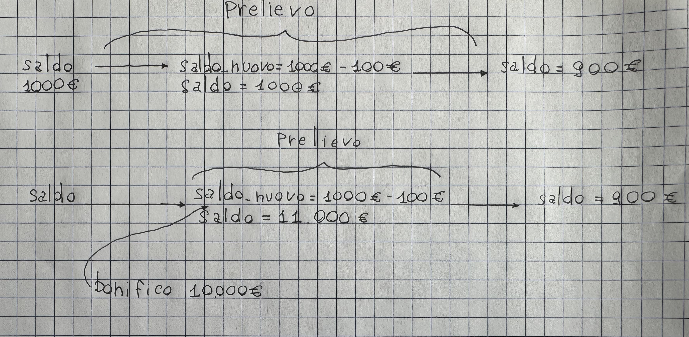
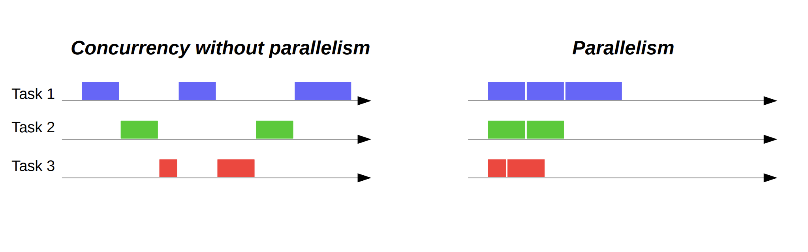

# Perché Il Calcolo Parallelo

## Introduzione

Il calcolo parallelo rappresenta una delle evoluzioni più significative nell'informatica moderna, con l'obiettivo primario di **ridurre i tempi di calcolo** e **distribuire efficacemente il carico di lavoro** tra le varie unità computazionali. 

Sebbene l'hardware sia ormai fortemente parallelizzato, lo sviluppo di software parallelo rimane una sfida complessa. Il passaggio da un'architettura seriale a una parallela non è mai banale e richiede spesso un **ripensamento completo** dell'algoritmo e della struttura del problema.

---

### Il Problema del Consumo Energetico

La diffusione massiva dell'hardware parallelo è stata guidata principalmente dalla necessità di **ridurre i consumi energetici**. La potenza dissipata da un processore è descritta dalla formula:

$$P = C \cdot V^2 \cdot f$$

dove:
- **$C$** è la capacità del circuito (quanto il circuito può immagazzinare energia)
- **$V$** è il voltaggio operativo del circuito
- **$f$** è la frequenza di clock, ovvero il numero di cicli per unità di tempo in cui il processore può cambiare il proprio stato

### La Soluzione: Più Core a Frequenze Ridotte

Come evidenziato dalla formula, la potenza è **proporzionale al quadrato del voltaggio**. Questo significa che riduzioni anche piccole del voltaggio portano a significativi risparmi energetici.

La strategia adottata dall'industria è stata:
1. **Ridurre la frequenza** di clock dei singoli processori
2. **Abbassare il voltaggio** operativo (possibile grazie alla minore frequenza)
3. **Aumentare il numero di core** per mantenere o superare le prestazioni complessive


*Il grafico mostra come l'industria sia passata da processori single-core ad alta frequenza a processori multi-core a frequenze ridotte, mantenendo o incrementando le prestazioni complessive con consumi inferiori.*

---

## La Pipeline: Parallelismo a Livello di Istruzione

### Il Concetto di Pipeline

Una delle forme più efficaci di parallelismo implementate nelle CPU moderne è la **pipeline** (o catena di montaggio). Questo meccanismo permette di eseguire più istruzioni contemporaneamente, suddividendo l'esecuzione di ogni istruzione in fasi distinte che possono sovrapporsi.

### Come Funziona una Pipeline

L'esecuzione di un'istruzione viene tipicamente suddivisa in 5 fasi principali:

1. **IF (Instruction Fetch)**: Prelievo dell'istruzione dalla memoria
2. **ID (Instruction Decode)**: Decodifica dell'istruzione e lettura dei registri
3. **EX (Execute)**: Esecuzione dell'operazione (ALU)
4. **MEM (Memory Access)**: Accesso alla memoria (se necessario)
5. **WB (Write Back)**: Scrittura del risultato nel registro di destinazione

Senza pipeline, ogni istruzione deve completare tutte le 5 fasi prima che la successiva possa iniziare. Con la pipeline, mentre un'istruzione è in fase di esecuzione (EX), la successiva può essere in fase di decodifica (ID), e quella dopo ancora in fase di prelievo (IF).

#### Esempio Visivo

**Esecuzione Seriale (senza pipeline)**:
```
Tempo:  1  2  3  4  5  6  7  8  9  10 11 12 13 14 15
Istr1: IF ID EX MEM WB
Istr2:                IF ID EX MEM WB
Istr3:                               IF ID EX MEM WB
```
Tempo totale: 15 cicli per 3 istruzioni

## Il Problema dei Salti Condizionali

#### Il Problema Fondamentale

I **salti condizionali** (branch) rappresentano il tallone d'Achille delle pipeline moderne. Il problema è semplice ma devastante per le prestazioni:

**Quando incontri un salto condizionale, non sai in anticipo quale set di istruzioni seguirà.**

Consideriamo questo pseudocodice:
```c
if (x > 10) {
    // blocco A - set di istruzioni 1
} else {
    // blocco B - set di istruzioni 2
}
```

#### Perché Questo Crea un Problema

La pipeline funziona caricando in anticipo le istruzioni successive. Ma con un `if`:

1. **Ciclo 1-2**: L'istruzione `if (x > 10)` viene prelevata e decodificata
2. **Ciclo 3**: La condizione viene finalmente valutata → **Solo ora** si scopre se x > 10!
3. **Il problema**: la pipeline ha già iniziato a caricare istruzioni successive, ma quali? Quelle del blocco A o del blocco B?

#### Due Opzioni, Entrambe Costose

**Opzione 1 - Attendere**
- Fermare la pipeline e aspettare di conoscere l'esito
- **Risultato**: 3-5 cicli di clock sprecati in attesa
- Come fermare una catena di montaggio e lasciare gli operai inattivi

**Opzione 2 - Indovinare (usata dalle CPU moderne)**
- La CPU fa una **previsione** (es. "probabilmente x > 10 sarà vero")
- Inizia a caricare le istruzioni del blocco A
- **Se indovina giusto**: tutto procede senza rallentamenti ✓
- **Se indovina male**: deve scartare tutto il lavoro fatto e ricaricare il blocco B ✗

#### Il Costo di un Errore

Quando la previsione è sbagliata:

1. Tutte le istruzioni già caricate nella pipeline vengono **scartate**
2. La pipeline viene **svuotata** completamente  
3. Il set di istruzioni **corretto** deve essere ricaricato da zero
4. La pipeline deve **ripartire**

**Tempo perso**: 10-20 cicli di clock nelle CPU moderne!

Questo processo di svuotamento e ricaricamento si chiama **pipeline flush** ed è il motivo per cui i salti condizionali rallentano drasticamente l'esecuzione del codice.

---

## Obiettivi e Sfide del Calcolo Parallelo

### Obiettivi Principali

Il calcolo parallelo mira a:
- **Ridurre il tempo di calcolo** per problemi complessi e di grandi dimensioni
- **Migliorare l'efficienza energetica** rispetto a soluzioni seriali ad alte prestazioni
- **Permettere la risoluzione** di problemi altrimenti intrattabili

### Requisiti per un'Efficace Parallelizzazione

Per ottenere un reale vantaggio rispetto all'esecuzione seriale, è necessario:

1. **Scomporre il problema** principale in sottoproblemi più semplici e possibilmente indipendenti
2. **Assegnare i sottoproblemi** alle componenti hardware più appropriate (CPU, GPU, acceleratori)
3. **Minimizzare la comunicazione** e la sincronizzazione tra le unità di calcolo
4. **Bilanciare il carico** di lavoro per evitare che alcune unità restino inattive

---

## Il Problema della Concorrenza

### Cos'è la Concorrenza

Uno degli aspetti più critici nella programmazione parallela è la **gestione della concorrenza**: quando più elemnti accedono contemporaneamente alla stessa area di memoria, possono verificarsi **race condition** che portano a risultati inconsistenti o errati.

### Esempio Pratico: Prelievo e Bonifico Bancario

Consideriamo un'operazione bancaria comune: il prelievo da un conto corrente. L'operazione richiede tre passaggi:

1. **Lettura del saldo** corrente
2. **Calcolo del nuovo saldo**: `saldo_nuovo = saldo - somma_prelevata`
3. **Aggiornamento del saldo**: `saldo = saldo_nuovo`

#### Scenario Problematico

Supponiamo che, mentre è in corso un prelievo, arrivi un bonifico che deve aggiornare il saldo aggiungendo un importo. Se il bonifico viene elaborato **tra il passo 2 e il passo 3** dell'operazione di prelievo, si verifica il seguente scenario:

| Tempo | Prelievo | Bonifico | Saldo in Memoria |
|-------|----------------|----------------|------------------|
| T0 | Legge saldo: 1000€ | | 1000€ |
| T1 | Calcola: 1000€ - 100€ = 900€ | | 1000€ |
| T2 | | Legge saldo: 1000€ | 1000€ |
| T3 | | Calcola: 1000€ + 10000€ = 11000€ | 1000€ |
| T4 | | Scrive saldo: 11000€ | **11000€** |
| T5 | Scrive saldo: 900€ | | **900€** |

**Risultato**: Il bonifico di 1000€ viene completamente perso! Il saldo finale è 900€ invece dei corretti 10900€.



*Visualizzazione della race condition: le operazioni concorrenti sul saldo portano alla perdita di dati.*
### Concorrenza Seriale e Parallela
Il problema della concorrenza è presente sia nelle architetture seriali, sia in quelle parallele, infatti è un problema legato alla condivisione dello stesso spazio di memoria. Nelle architetture seriali viene eseguita una sola task alla volta, per farlo viene fatta una partizione temporale, detta time slicing, che riserva la componente di calcolo il tempo necessario per eseguire una delle task. Il problema della concorrenza avviene anche in questo caso, infatti quando più task condividono lo stesso dato, è possibile avere risultati non consistenti. Nel caso di architetture parallele invece le task vengono eseguite, a patto di avere abbastanza core, simultaneamente e in questo caso il problema della concorrenza viene esacerbato portando, se non adeguatamente controllato, a risultati non consistenti e imprevedibili. 



### Soluzioni alla Concorrenza

Per evitare questi problemi, la programmazione parallela richiede:
- **Mutex e lock**: meccanismi di esclusione mutua per garantire accesso esclusivo alle risorse condivise
- **Semafori**: per coordinare l'accesso a risorse limitate
- **Transazioni atomiche**: operazioni che vengono eseguite completamente o per nulla
- **Strutture dati lock-free**: progettate per minimizzare la sincronizzazione

---

## Conclusioni

Il calcolo parallelo rappresenta sia una **necessità tecnologica** (per gestire consumi energetici e limiti fisici) sia una **sfida ingegneristica** complessa. 

La sua efficacia dipende non solo dall'hardware disponibile, ma soprattutto dalla capacità dei programmatori di:
- Identificare opportunità di parallelizzazione
- Gestire correttamente la sincronizzazione
- Evitare race condition e deadlock
- Bilanciare il carico tra le unità di calcolo

Nonostante le difficoltà, il calcolo parallelo è ormai **indispensabile** per affrontare problemi moderni in ambiti come l'intelligenza artificiale, la simulazione scientifica, l'analisi di grandi quantità di dati e il rendering grafico.
