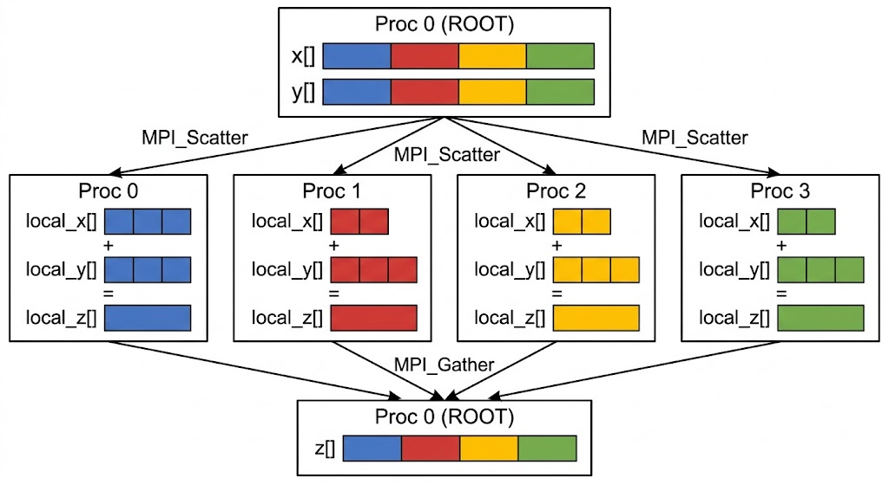
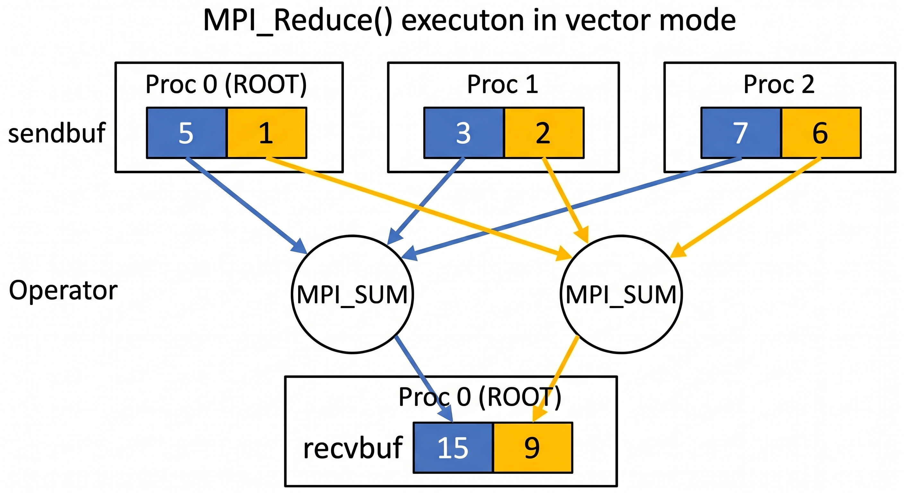

# Appunti Seconda Parte IN480

---

#

## MPI 

> MPI è lo standard utilizzato nel calcolo distribuito sui supercalcolatori. Si basa sul paradigma SPMD (*Single Program Multiple Data*), in cui lo stesso programma viene eseguito simultaneamente da processi distinti su macchine differenti. A differenza di OpenMP, non si basa su direttive ma è una libreria software che offre un controllo a basso livello sulle componenti del sistema, garantendo un'ottimizzazione spinta della computazione. Il suo utilizzo è necessario quando la taglia del problema eccede le capacità di una singola macchina.
> 
> **Vantaggi:**
> * **Scalabilità:** Permette di superare i limiti di memoria della singola macchina, perciò tratta problemi di grossa taglia.
> * **Sicurezza:** Assenza di *data race*, dato che ogni processo ha il proprio spazio di memoria privato.
> 
> **Svantaggi:**
> * **Overhead di rete:** Lo scambio di messaggi e la sincronizzazione avvengono tramite subroutine via rete, introducendo latenze che possono rallentare l'esecuzione.
> * **Errori di comunicazione:** Essendo che i dati vanno inviati, ci si espone a possibili errori di comunicazione.
> * **Complessità:** Il codice diventa sensibilmente più lungo, articolato e difficile da gestire rispetto al paradigma a memoria condivisa.

### Pseudo-Codice


```c
#include <mpi.h>
#include <stdio.h>

int main(int argc, char** argv) {
    int rank, size;

    // 1. Inizializza l'ambiente MPI, e si passano i parametri perché MPI ne aggiunge altri
    MPI_Init(&argc, &argv);

    // 2. Ottiene il numero totale di processi avviati
    MPI_Comm_size(MPI_COMM_WORLD, &size);

    // 3. Ottiene l'identificativo (ID) del processo corrente
    MPI_Comm_rank(MPI_COMM_WORLD, &rank);

    // Ogni processo stampa questo messaggio autonomamente
    printf("Ciao! Sono il processo %d di un totale di %d\n", rank, size);

    // 4. Termina in modo sicuro l'ambiente MPI
    MPI_Finalize();
    
    return 0;
}
```


## Comunicazione tra Processi

Per ottimizzare lo scambio di dati nel calcolo distribuito, MPI organizza i processi in **comunicatori** (gruppi di processi), dove ciascun processo riceve un identificativo univoco chiamato `rank`. Il comunicatore globale che include tutti i processi del sistema è `MPI_COMM_WORLD`.

Per migliorare le prestazioni e la portabilità, MPI permette di definire appositi **datatypes**. Questi consentono di descrivere layout di memoria complessi, facilitando il trasferimento rapido dei dati tra i nodi.

La comunicazione punto-a-punto sfrutta inoltre un `tag` (un intero scelto dall'utente) per qualificare il messaggio. Se i criteri di una `MPI_Recv` non coincidono con il tag del messaggio in arrivo, la funzione rimane in attesa, mentre il messaggio non corrispondente viene temporaneamente preservato nel buffer di rete. Spesso si utilizza la wildcard `MPI_ANY_TAG` per accettare messaggi con qualunque identificativo, recuperando successivamente il tag effettivo tramite il parametro di `status`.

Le comunicazioni in MPI si dividono in punto-punto e collettive:

* **Punto-punto:** Coinvolgono coppie di processi. Su supercalcolatori con un alto numero di nodi, utilizzarle per comunicazioni globali comporta lo svantaggio di dover eseguire moltissime chiamate di funzione, generando un grande overhead e problemi di scalabilità.
* **Collettive:** Operano a un livello di astrazione più alto su interi gruppi di processi. Sostituiscono i cicli di comunicazioni punto-punto, ottimizzando intrinsecamente lo scambio di dati e la sincronizzazione tramite l'hardware di rete.

## Comunicazioni Punto-Punto
Le comunicazioni punto-punto sono necessarie per lo scambio di dati tra singoli nodi. Tuttavia quando lo stesso dato deve essere distribuito a più processi — o più in generale quando tutti i processi partecipano a uno scambio coordinato — usare ripetutamente MPI_Send/MPI_Recv risulta poco efficiente: comporta molte chiamate a funzione (overhead elevato), aumenta il rischio di errori nella gestione dei rank, e non sfrutta gli algoritmi ottimizzati (es. broadcast ad albero) che le funzioni collettive implementano internamente.
### MPI_Send

#### Definizione

```c
int MPI_Send(const void *buf, int count, MPI_Datatype datatype, int dest, int tag, MPI_Comm comm)
```

#### Parametri

| Parametro  | Tipo            | Descrizione                                        |
|------------|-----------------|----------------------------------------------------|
| `buf`      | `const void *`  | Puntatore al buffer contenente i dati da inviare   |
| `count`    | `int`           | Numero di elementi da inviare                      |
| `datatype` | `MPI_Datatype`  | Tipo MPI degli elementi (es. `MPI_INT`, `MPI_DOUBLE`) |
| `dest`     | `int`           | `rank_id` del processo ricevente                   |
| `tag`      | `int`           | Etichetta del messaggio (intero non negativo)      |
| `comm`     | `MPI_Comm`      | Comunicatore MPI (es. `MPI_COMM_WORLD`)            |


#### Comportamento bloccante

`MPI_Send` è una funzione **bloccante**: ritorna solo quando il buffer `buf` è **sicuro da riutilizzare**, ovvero quando MPI ha copiato i dati nel proprio sistema interno (buffer di sistema o canale di trasmissione).

> ⚠️ **Attenzione:** il ritorno della funzione **non garantisce** che il messaggio sia stato consegnato al processo ricevente. La consegna può avvenire in modo asincrono, dopo il ritorno.

#### MPI_PROC_NULL
Se `dest` è impostato a `MPI_PROC_NULL`, la chiamata **non ha alcun effetto**: viene trattata come un'operazione nulla e ritorna immediatamente.

### MPI_Recv

#### Definizione

```c
int MPI_Recv(void *buf, int count, MPI_Datatype datatype, int source, int tag, MPI_Comm comm, MPI_Status *status)
```

#### Parametri

| Parametro  | Tipo            | Descrizione                                              |
|------------|-----------------|----------------------------------------------------------|
| `buf`      | `void *`        | Puntatore al buffer in cui verrà scritto il dato ricevuto |
| `count`    | `int`           | Numero **massimo** di elementi che il buffer può contenere |
| `datatype` | `MPI_Datatype`  | Tipo MPI degli elementi (es. `MPI_INT`, `MPI_DOUBLE`)    |
| `source`   | `int`           | `rank_id` del mittente (o `MPI_ANY_SOURCE`)              |
| `tag`      | `int`           | Etichetta del messaggio (o `MPI_ANY_TAG`)                |
| `comm`     | `MPI_Comm`      | Comunicatore MPI (es. `MPI_COMM_WORLD`)                  |
| `status`   | `MPI_Status *`  | Struttura con informazioni sul messaggio ricevuto        |


#### Comportamento bloccante

`MPI_Recv` è una funzione **bloccante**: ritorna solo quando il dato è stato effettivamente scritto nel buffer `buf` ed è pronto per essere usato. Per eseguire il resto del codice la funzione aspetta che il dato venga ricevuto. Questo comportamento risulta utile perché, tipicamente, il dato atteso è necessario per proseguire con la computazione.

> `MPI_Recv` **garantisce** che il dato sia disponibile nel buffer al momento del ritorno.


#### MPI_Status

La struttura `status` contiene informazioni sul messaggio ricevuto:

| Campo              | Descrizione                          |
|--------------------|--------------------------------------|
| `MPI_SOURCE`       | Rank del mittente effettivo          |
| `MPI_TAG`          | Tag del messaggio ricevuto           |
| `MPI_ERROR`        | Codice di errore                     |

Utile soprattutto quando si usano wildcards (`MPI_ANY_SOURCE`, `MPI_ANY_TAG`), per sapere chi ha effettivamente inviato il messaggio e con quale tag.  
Se le informazioni non servono, si può passare `MPI_STATUS_IGNORE`.

#### Count e dimensione del messaggio

`count` specifica la **capienza massima** del buffer, non il numero esatto di elementi attesi.

- Se il messaggio ricevuto contiene **meno elementi** di `count`: nessun errore, il buffer viene riempito parzialmente.
- Se il messaggio ricevuto contiene **più elementi** di `count`: errore di overflow (`MPI_ERR_TRUNCATE`).

Per sapere quanti elementi sono stati **effettivamente ricevuti** si usa `MPI_Get_count()`:

```c
int MPI_Get_count(const MPI_Status *status, MPI_Datatype datatype, int *count)
```

Legge dalla struttura `status` il numero di elementi ricevuti e lo scrive in `count`. Va chiamata **dopo** `MPI_Recv`, passando lo stesso `datatype` usato nella ricezione.

```c
int received;
MPI_Get_count(&status, MPI_INT, &received);
```

#### Wildcards

| Costante          | Usata per | Effetto                                        |
|-------------------|-----------|------------------------------------------------|
| `MPI_ANY_SOURCE`  | `source`  | Accetta messaggi da qualsiasi mittente         |
| `MPI_ANY_TAG`     | `tag`     | Accetta messaggi con qualsiasi etichetta       |

### Deadlocks
 
Nell'utilizzo di `MPI_Send` e `MPI_Recv` bisogna prestare particolare attenzione a possibili deadlock. Poiché entrambe le funzioni sono **bloccanti**, se due processi si aspettano a vicenda senza che nessuno dei due proceda, il programma si blocca indefinitamente.
 
#### Scenario classico
 
Il caso più comune si verifica quando due processi vogliono scambiarsi dati e chiamano entrambi `MPI_Send` prima di chiamare `MPI_Recv`:
 
```
Processo 0                  Processo 1
──────────────────          ──────────────────
MPI_Send → P1   ────┐  ┌─── MPI_Send → P0
                    │  │
                (entrambi bloccati: aspettano
                 che l'altro chiami Recv)
                    │  │
MPI_Recv ← P1   ────┘  └─── MPI_Recv ← P0
         (mai raggiunta)      (mai raggiunta)
```
 
`MPI_Send` è bloccante: il processo 0 resta fermo finché il messaggio non viene preso in carico dal sistema MPI. Se anche il processo 1 sta facendo lo stesso contemporaneamente, nessuno dei due chiama mai `MPI_Recv` e il programma si blocca.
 
> ⚠️ Il comportamento dipende dall'implementazione MPI: per messaggi **piccoli** alcuni sistemi bufferizzano internamente il messaggio e la Send ritorna subito, mascherando il deadlock. Per messaggi **grandi** il buffer si esaurisce e il deadlock si manifesta. Non fare affidamento su questo comportamento.
 
#### Soluzione: invertire l'ordine su un processo
 
Basta che uno dei due chiami `MPI_Recv` prima di `MPI_Send`:
 
```
Processo 0                  Processo 1
──────────────────          ──────────────────
MPI_Send → P1   ──────────► MPI_Recv ← P0    ✓
MPI_Recv ← P1   ◄────────── MPI_Send → P0    ✓
```
 
In questo modo il processo 1 è già in ascolto quando il processo 0 invia, e lo scambio avviene senza blocchi. 

### MPI_Sendrecv — Scambio simultaneo e sicuro

Un'alternativa più robusta per evitare i deadlock quando due processi devono scambiarsi dati contemporaneamente (come nel caso dello scambio di *ghost cells*) è l'utilizzo di `MPI_Sendrecv`. Questa funzione esegue un'operazione di invio e una di ricezione in un'unica chiamata, demandando a MPI la gestione interna delle precedenze e dei buffer per scongiurare qualsiasi blocco.

#### Definizione

```c
int MPI_Sendrecv(const void *sendbuf, int sendcount, MPI_Datatype sendtype,
                 int dest, int sendtag,
                 void *recvbuf, int recvcount, MPI_Datatype recvtype,
                 int source, int recvtag,
                 MPI_Comm comm, MPI_Status *status)
```

I parametri sono semplicemente la concatenazione di quelli di una `MPI_Send` e di una `MPI_Recv`.

#### Parametri

| Parametro | Tipo | Descrizione |
|---|---|---|
| `sendbuf` | `const void *` | Puntatore al buffer dei dati da inviare |
| `sendcount` | `int` | Numero di elementi da inviare |
| `sendtype` | `MPI_Datatype` | Tipo MPI degli elementi da inviare |
| `dest` | `int` | Rank del processo ricevente |
| `sendtag` | `int` | Etichetta del messaggio in uscita |
| `recvbuf` | `void *` | Puntatore al buffer in cui salvare i dati in ingresso |
| `recvcount` | `int` | Numero massimo di elementi da ricevere |
| `recvtype` | `MPI_Datatype` | Tipo MPI degli elementi da ricevere |
| `source` | `int` | Rank del processo mittente |
| `recvtag` | `int` | Etichetta del messaggio in ingresso |
| `comm` | `MPI_Comm` | Comunicatore MPI |
| `status` | `MPI_Status *` | Status della ricezione (o `MPI_STATUS_IGNORE`) |

#### Perché utilizzarla?

* **Zero Deadlock:** I processi possono richiamarla simultaneamente senza preoccuparsi dell'ordine di esecuzione, perché MPI gestisce la comunicazione bidirezionale in modo sicuro.
* **Codice più pulito:** Sostituisce i blocchi condizionali (es. `if (rank % 2 == 0) { invia; ricevi; } else { ricevi; invia; }`) rendendo il codice molto più leggibile, compatto e meno prono a errori umani.

> ⚠️ **Attenzione ai buffer:** I buffer `sendbuf` e `recvbuf` devono essere **disgiunti** in memoria. Non è possibile inviare e ricevere dati sovrascrivendo la stessa area di memoria (se serve questo comportamento, esiste una variante apposita chiamata `MPI_Sendrecv_replace`).

### MPI_Isend e MPI_Irecv — Comunicazioni non bloccanti

`MPI_Isend` e `MPI_Irecv` sono le versioni **non bloccanti** di `MPI_Send` e `MPI_Recv`: avviano l'operazione di comunicazione e ritornano **immediatamente**, senza aspettarne il completamento.

#### Definizioni

```c
int MPI_Isend(const void *buf, int count, MPI_Datatype datatype,
              int dest, int tag, MPI_Comm comm, MPI_Request *request)

int MPI_Irecv(void *buf, int count, MPI_Datatype datatype,
              int source, int tag, MPI_Comm comm, MPI_Request *request)
```

Il parametro aggiuntivo rispetto alle versioni bloccanti è `MPI_Request *request`: un handle che identifica l'operazione in corso e viene usato in seguito per verificarne il completamento.

#### Completamento: MPI_Wait e MPI_Test

Poiché le funzioni ritornano prima che la comunicazione sia conclusa, è necessario sincronizzarsi esplicitamente prima di accedere al buffer:

```c
// Blocca finché l'operazione non è completata
MPI_Wait(MPI_Request *request, MPI_Status *status)

// Non bloccante: controlla se l'operazione è completata (flag = 1) o no (flag = 0)
MPI_Test(MPI_Request *request, int *flag, MPI_Status *status)
```

> ⚠️ **Regola fondamentale:** il buffer `buf` **non deve essere letto né modificato** tra la chiamata a `MPI_Isend`/`MPI_Irecv` e il completamento confermato da `MPI_Wait` o `MPI_Test`. Farlo è undefined behavior.

#### Pattern d'uso tipico

```c
MPI_Request req;

MPI_Isend(buf, count, MPI_INT, dest, tag, MPI_COMM_WORLD, &req);

// computazione indipendente dalla comunicazione...
do_work();

MPI_Wait(&req, MPI_STATUS_IGNORE); // attende il completamento
```

In questo modo la comunicazione avviene **in parallelo** con `do_work()`, nascondendo la latenza di rete.

#### Confronto bloccante vs non bloccante

```
MPI_Send (bloccante)
────────────────────────────────────────────────────
[  Send (attesa)  ][  computazione  ]

MPI_Isend (non bloccante)
────────────────────────────────────────────────────
[Isend][ computazione  ][Wait]
          ↑
    comunicazione in corso in background
```

| Aspetto               | MPI_Send / MPI_Recv       | MPI_Isend / MPI_Irecv              |
|-----------------------|---------------------------|------------------------------------|
| Ritorno               | Solo a completamento      | Immediato                          |
| Buffer dopo chiamata  | Subito riutilizzabile     | Non toccare prima di MPI_Wait      |
| Rischio deadlock      | Alto (ordine critico)     | Basso (non si bloccano a vicenda)  |
| Overlap comm/compute  | ✗                         | ✓                                  |
| Complessità del codice| Bassa                     | Più alta                           |

#### Perché MPI_Isend è molto utile

Nelle applicazioni HPC il tempo speso in comunicazione è spesso il collo di bottiglia. `MPI_Isend` permette di **sovrapporre comunicazione e computazione**: mentre i dati viaggiano sulla rete, il processo può già lavorare sulla parte di computazione che non dipende da quei dati. Questo pattern, detto *latency hiding*, può portare a speedup significativi rispetto all'alternativa bloccante, soprattutto in applicazioni con molti scambi tra processi.

Inoltre, poiché `MPI_Isend` e `MPI_Irecv` non si bloccano, due processi possono chiamarle entrambi nello stesso ordine **senza rischio di deadlock**, semplificando la gestione della sincronizzazione rispetto alle versioni bloccanti.

### MPI_Abort

La funzione `MPI_Abort()` viene utilizzata nell'ambito della programmazione parallela con MPI (Message Passing Interface) per forzare la terminazione anomala di tutti i processi appartenenti a un determinato comunicatore (generalmente `MPI_COMM_WORLD`). 
Il caso d'uso tipico si verifica quando **un errore critico e irrecuperabile intercorre su uno solo dei nodi** o processi della griglia computazionale. In un'applicazione parallela, i nodi sono strettamente interconnessi tramite operazioni di comunicazione bloccanti (come `MPI_Send`, `MPI_Recv` o barriere di sincronizzazione come `MPI_Barrier`). Se un singolo nodo dovesse fallire o interrompere la sua esecuzione silenziosamente senza notificare gli altri, l'intera applicazione entrerebbe in uno stato di **deadlock** (blocco indefinito), continuando a consumare risorse del cluster senza produrre alcun risultato. Invocando `MPI_Abort(MPI_COMM_WORLD, error_code)`, il nodo che ha riscontrato l'anomalia ordina all'ambiente di runtime di MPI di terminare immediatamente e in modo pulito tutti gli altri processi, restituendo un codice d'errore (`error_code`) utile per il debugging.
L'uso di una normale funzione di sistema come `exit()` terminerebbe unicamente il processo locale in cui si è verificato l'errore. Essendo i nodi distribuiti su un'infrastruttura di rete, propagare in modo affidabile e automatico questo stato di uscita a tutti gli altri nodi risulterebbe estremamente difficile. Di conseguenza, il nodo guasto si spegnerebbe in isolamento, mentre il resto del cluster continuerebbe l'esecuzione rimanendo fatalmente bloccato in attesa di comunicazioni (deadlock).

## Le Comunicazioni Collettive in MPI

Nel calcolo parallelo con **MPI (Message Passing Interface)**, le comunicazioni collettive (come `MPI_Bcast`, `MPI_Reduce` o `MPI_Gather`) coordinano lo scambio di dati tra tutti i processi di un comunicatore in un'unica operazione, offrendo vantaggi prestazionali netti rispetto alle comunicazioni punto-punto (`MPI_Send`/`MPI_Recv`). Saperle usare correttamente è quindi un requisito chiave per un programmatore nell'ambito del calcolo distribuito.

### Perché le Collettive sono più efficienti delle Punto-Punto:

1. **Complessità Algoritmica $O(\log N)$**: Se un processo master invia un dato a $N$ nodi tramite punto-punto, impiega un tempo lineare $O(N)$. Le funzioni collettive utilizzano invece algoritmi ad albero (es. alberi binomiali) in cui i nodi intermedi ridistribuiscono il messaggio, abbattendo la complexity a livello logaritmico $O(\log N)$.
2. **Ottimizzazione Topologica (Hardware Awareness)**: Le librerie MPI riconoscono l'architettura sottostante. Sfruttano la memoria condivisa per i processi sullo stesso nodo e il multicast hardware (es. InfiniBand) per il traffico di rete, ottimizzando il percorso dei dati in modo trasparente all'utente.
3. **Riduzione dell'Overhead e dei Deadlock**: Gestire manualmente decine di comunicazioni punto-punto aumenta il rischio di colli di bottiglia sul master e di blocchi reciproci (*deadlock*). Le collettive offrono una sincronizzazione implicita e ottimizzata, riducendo l'overhead di controllo e semplificando la struttura del codice.

### MPI_Barrier
La funzione `MPI_Barrier(comm)` è un'operazione di sincronizzazione collettiva che agisce su un gruppo di processi associati a uno specifico comunicatore, come ad esempio `MPI_COMM_WORLD`. Quando un processo raggiunge ed esegue questa istruzione, si blocca e attende finché tutti gli altri processi appartenenti al gruppo non hanno raggiunto a loro volta la medesima chiamata. Solo quando tutti i processi sono arrivati alla barriera, questi vengono sbloccati e sono liberi di proseguire la loro esecuzione.

#### Vantaggi
* **Gestione sicura delle fasi:** Rappresenta un modo estremamente semplice e diretto per separare due fasi distinte di una computazione parallela, garantendo che i messaggi generati in una fase non interferiscano con quelli della fase successiva.

#### Svantaggi
* **Overhead prestazionale:** Trattandosi di un'operazione globale che richiede la partecipazione e l'attesa di tutti i processi del comunicatore, può risultare molto dispendiosa in termini di tempo e rallentare significativamente l'esecuzione del programma.
* **Spesso evitabile:** In molti casi, l'invocazione di `MPI_Barrier()` dovrebbe essere evitata, poiché la sincronizzazione tra i processi può essere ottenuta in modo più efficiente strutturando correttamente l'indirizzamento esplicito delle comunicazioni (ad esempio sfruttando i `tag`, l'identificativo del mittente `source` o l'isolamento garantito da comunicatori separati).

### MPI_Bcast
La funzione `MPI_Bcast()` (Broadcast) permette a un singolo processo, definito "root", di inviare una copia esatta degli stessi dati a tutti gli altri processi appartenenti a un determinato gruppo o comunicatore. Essendo un'operazione collettiva, la funzione deve essere obbligatoriamente invocata da tutti i processi del gruppo.

#### Argomenti della funzione
La sintassi di base è `MPI_Bcast(buffer, count, datatype, root, comm)`:
* **`buffer`**: puntatore all'area di memoria dei dati. Per il processo `root` rappresenta l'indirizzo da cui leggere i dati da inviare; per tutti gli altri processi rappresenta l'indirizzo in cui scrivere i dati ricevuti.
* **`count`**: numero di elementi che compongono il messaggio.
* **`datatype`**: tipo di dato degli elementi trasmessi (es. `MPI_INT`).
* **`root`**: l'identificativo (rank) del processo mittente che possiede i dati iniziali.
* **`comm`**: il comunicatore di riferimento (es. `MPI_COMM_WORLD`).

#### Schema di funzionamento
Ecco un esempio di come si propaga il buffer se il processo sorgente (`root`) è il *Proc 1* e deve inviare 3 elementi (identificati come 1, 2, 3) a un totale di 4 processi.

**Prima della chiamata a `MPI_Bcast()`**  
Proc 0: `[   |   |   ]`  
Proc 1: `[ 1 | 2 | 3 ]`  <-- ROOT  
Proc 2: `[   |   |   ]`  
Proc 3: `[   |   |   ]`  

**Dopo la chiamata a `MPI_Bcast()`**  
Proc 0: `[ 1 | 2 | 3 ]`    
Proc 1: `[ 1 | 2 | 3 ]`  
Proc 2: `[ 1 | 2 | 3 ]`  
Proc 3: `[ 1 | 2 | 3 ]`  


### MPI_Scatter

La funzione `MPI_Scatter()` esegue un'operazione di distribuzione dei dati (ed è concettualmente l'inverso di `MPI_Gather()`). Prende un blocco di dati contigui residente su un singolo processo (definito "root"), lo divide in segmenti di uguale dimensione e invia un segmento distinto a ciascun processo all'interno del gruppo (incluso il root stesso).

#### Argomenti della funzione
La sintassi standard è `MPI_Scatter(sendbuf, sendcnt, sendtype, recvbuf, recvcnt, recvtype, root, comm)`:
* **`sendbuf`**: puntatore all'array dei dati da suddividere (rilevante e letto solo dal processo `root`).
* **`sendcnt`**: numero di elementi (non di byte!) inviati a *ciascun singolo processo*, non il totale degli elementi dell'array.
* **`sendtype`**: tipo di dato degli elementi nel buffer di invio (es. `MPI_INT`).
* **`recvbuf`**: puntatore all'area di memoria in cui il processo ricevente salverà la propria porzione.
* **`recvcnt`**: numero di elementi che ciascun processo riceve (solitamente coincide con `sendcnt`).
* **`recvtype`**: tipo di dato degli elementi nel buffer di ricezione.
* **`root`**: l'identificativo (rank) del processo che possiede i dati iniziali da sparpagliare.
* **`comm`**: il comunicatore di riferimento (es. `MPI_COMM_WORLD`).

> 💡 **Nota bene sui parametri di invio e ricezione:**
> La presenza di parametri distinti per l'invio (`sendcnt`, `sendtype`) e per la ricezione (`recvcnt`, `recvtype`) deriva dal fatto che `MPI_Scatter()` produce lo stesso risultato di una serie di chiamate `MPI_Send` eseguite dal nodo root e di chiamate `MPI_Recv` eseguite da tutti gli altri processi. Questo design non è ridondante, ma permette esplicitamente che **i tipi di dato e le quantità possano essere differenti** tra mittente e destinatario. MPI infatti non richiede che i processi comunicanti utilizzino la stessa rappresentazione dei dati. Tuttavia nella stragrande maggioranza dei casi questi valori coincideranno, infatti cambiare il tipo di dati è fortemente sconsigliato.

#### Schema di funzionamento
Ecco uno schema di come viene "sparpagliato" l'array. Supponiamo che il **Proc 0** sia il `root` e possegga un array di 12 elementi da distribuire a un totale di 4 processi. In questo caso, `sendcnt` e `recvcnt` varranno 3, poiché ogni processo riceverà 3 elementi.

**Prima della chiamata a `MPI_Scatter()`**  
Proc 0 (ROOT): `sendbuf = [ 1 | 2 | 3 | 4 | 5 | 6 | 7 | 8 | 9 | 10 | 11 | 12 ]`  
Proc 1:        `recvbuf = [   |   |   ]`  
Proc 2:        `recvbuf = [   |   |   ]`  
Proc 3:        `recvbuf = [   |   |   ]`  

**Dopo la chiamata a `MPI_Scatter()`**  
Proc 0: `recvbuf = [ 1 |  2 |  3 ]`  
Proc 1: `recvbuf = [ 4 |  5 |  6 ]`  
Proc 2: `recvbuf = [ 7 |  8 |  9 ]`  
Proc 3: `recvbuf = [ 10| 11 | 12 ]`  


### MPI_Gather

La funzione `MPI_Gather()` implementa una comunicazione collettiva di tipo "molti-a-uno" (all-to-one) ed è l'esatta operazione inversa di `MPI_Scatter()`. Essa raccoglie dati distinti provenienti dai buffer di invio di ciascun processo all'interno del gruppo (incluso il nodo destinatario) e li concatena in ordine di rank nel buffer di ricezione di un singolo processo specificato, definito "root".

#### Argomenti della funzione
La sintassi standard è `MPI_Gather(sendbuf, sendcnt, sendtype, recvbuf, recvcnt, recvtype, root, comm)`:
* **`sendbuf`**: puntatore all'area di memoria contenente i dati che il singolo processo deve inviare.
* **`sendcnt`**: numero di elementi inviati dal singolo processo.
* **`sendtype`**: tipo di dato degli elementi nel buffer di invio.
* **`recvbuf`**: puntatore all'area di memoria in cui il processo `root` salverà i dati raccolti. È rilevante solo per il processo `root`, che deve aver allocato preventivamente spazio sufficiente per contenere tutti i dati in arrivo.
* **`recvcnt`**: numero di elementi che il root riceve *da ciascun singolo processo* (non il totale).
* **`recvtype`**: tipo di dato degli elementi attesi nel buffer di ricezione.
* **`root`**: l'identificativo (rank) del processo destinatario che raccoglierà tutti i messaggi.
* **`comm`**: il comunicatore di riferimento (es. `MPI_COMM_WORLD`).

> 💡 **Nota bene sui parametri:**
> Anche per `MPI_Gather()` le quantità e i tipi di dato dichiarati per l'invio e per la ricezione possono differire tra loro, consentendo alle operazioni di rete di gestire la conversione tra processi o piattaforme eterogenee. 

#### Schema di funzionamento
Ecco uno schema di come i dati vengono raccolti. Supponiamo che il **Proc 1** sia il processo destinatario (`root`) e che tutti i 4 processi del comunicatore debbano inviare 3 elementi ciascuno. In questo caso, `sendcnt` e `recvcnt` varranno 3.

**Prima della chiamata a `MPI_Gather()`**  
Proc 0:        `sendbuf = [  1 |  2 |  3 ]`  
Proc 1 (ROOT): `sendbuf = [  4 |  5 |  6 ]`  
Proc 2:        `sendbuf = [  7 |  8 |  9 ]`  
Proc 3:        `sendbuf = [ 10 | 11 | 12 ]`  

**Dopo la chiamata a `MPI_Gather()`**  
Proc 0: (Dati inviati)  
Proc 1: `recvbuf = [ 1 | 2 | 3 | 4 | 5 | 6 | 7 | 8 | 9 | 10 | 11 | 12 ]`  
Proc 2: (Dati inviati)  
Proc 3: (Dati inviati)  

Ecco un esempio pratico che unisce l'utilizzo di `MPI_Scatter` e `MPI_Gather` per risolvere un problema classico: la **somma di due vettori**. 

L'idea alla base di questo schema è il pattern "distribuisci, calcola, raccogli" (scatter-compute-gather). Il processo "root" (solitamente il Proc 0) possiede i due array completi iniziali. Utilizza la Scatter per dividere i dati e inviarli ai vari nodi. Ogni nodo esegue la somma solo sulla sua piccola porzione di dati, generando un frammento del risultato. Infine, il root usa la Gather per ricomporre i frammenti nel vettore risultato finale.


### Esempio Pratico: Somma di Vettori Parallela

La combinazione delle funzioni `MPI_Scatter` e `MPI_Gather` è ideale per parallelizzare operazioni su array come la somma di due vettori, $x$ e $y$, per ottenere un vettore risultato $z$ (dove $z_i = x_i + y_i$). 

Il processo si divide in tre fasi principali:
1. **Distribuzione (Scatter):** Il processo `root` (Proc 0) invoca `MPI_Scatter` due volte: una per frammentare e distribuire il vettore $x$ e una per il vettore $y$. Ogni processo riceve così i propri array parziali (`local_x` e `local_y`).
2. **Calcolo locale:** Ogni processo, in parallelo e in modo indipendente, esegue un normale ciclo `for` per sommare elemento per elemento i suoi `local_x` e `local_y`, salvando il risultato in un array `local_z`.
3. **Raccolta (Gather):** Il processo `root` invoca `MPI_Gather` per raccogliere tutti i `local_z` dai vari processi e concatenarli nel vettore finale $z$.

#### Schema di funzionamento



### MPI_Allgather()

La funzione `MPI_Allgather()` combina in un'unica operazione la raccolta e la distribuzione globale dei dati. Ogni processo nel comunicatore invia la propria porzione di dati e, al termine dell'operazione, **tutti** i processi possiedono l'intero set di dati concatenato. Concettualmente, equivale a eseguire una `MPI_Gather()` (per raccogliere i dati su un nodo) seguita immediatamente da una `MPI_Bcast()` (per trasmettere il risultato a tutti).

#### Argomenti della funzione
Poiché il risultato viene distribuito a tutti i nodi, **non è presente l'argomento `root`**. La sintassi standard è `MPI_Allgather(sendbuf, sendcnt, sendtype, recvbuf, recvcnt, recvtype, comm)`:
* **`sendbuf`**: puntatore all'area di memoria contenente i dati che il singolo processo deve inviare.
* **`sendcnt`**: numero di elementi inviati dal singolo processo.
* **`sendtype`**: tipo di dato degli elementi nel buffer di invio.
* **`recvbuf`**: puntatore all'area di memoria in cui **ogni processo** salverà i dati totali raccolti. *Tutti* i processi devono aver allocato spazio sufficiente per contenere i dati provenienti dall'intero gruppo.
* **`recvcnt`**: numero di elementi che ciascun processo riceve *da ogni singolo nodo* (non la dimensione totale dell'array finale).
* **`recvtype`**: tipo di dato degli elementi nel buffer di ricezione.
* **`comm`**: il comunicatore di riferimento (es. `MPI_COMM_WORLD`).

#### Schema di funzionamento
Supponiamo di avere 4 processi nel comunicatore. Ognuno di essi possiede un array `sendbuf` di 3 elementi. Impostando `sendcnt = 3` e `recvcnt = 3`, al termine dell'operazione tutti e 4 i processi avranno un array `recvbuf` identico di 12 elementi (ordinati in base al rank del mittente).

**Prima della chiamata a `MPI_Allgather()`**  
Proc 0: `sendbuf = [  1 |  2 |  3 ]`  
Proc 1: `sendbuf = [  4 |  5 |  6 ]`  
Proc 2: `sendbuf = [  7 |  8 |  9 ]`  
Proc 3: `sendbuf = [ 10 | 11 | 12 ]`  

**Dopo la chiamata a `MPI_Allgather()`**  
Proc 0: `recvbuf = [ 1 | 2 | 3 | 4 | 5 | 6 | 7 | 8 | 9 | 10 | 11 | 12 ]`  
Proc 1: `recvbuf = [ 1 | 2 | 3 | 4 | 5 | 6 | 7 | 8 | 9 | 10 | 11 | 12 ]`  
Proc 2: `recvbuf = [ 1 | 2 | 3 | 4 | 5 | 6 | 7 | 8 | 9 | 10 | 11 | 12 ]`  
Proc 3: `recvbuf = [ 1 | 2 | 3 | 4 | 5 | 6 | 7 | 8 | 9 | 10 | 11 | 12 ]`  

### Comunicazioni Collettive Irregolari: `MPI_Scatterv()` e `MPI_Gatherv()`

Le funzioni `MPI_Scatterv()` e `MPI_Gatherv()` (dove la "v" sta per *vector*) sono le versioni estese delle normali operazioni di distribuzione e raccolta. A differenza delle varianti base, permettono di gestire **messaggi di dimensioni irregolari**, di lasciare **spazi vuoti (gaps)** tra i dati e di distribuire o raccogliere le porzioni di array in **qualsiasi ordine**.

> ⚠️ **ATTENZIONE: Altamente Proni all'Errore**
> Avere questa flessibilità ha un costo altissimo in termini di complessità del codice. L'utilizzo di queste funzioni richiede la costruzione e la gestione manuale di array aggiuntivi per calcolare esattamente quanti elementi spezzare per ogni nodo e da quale indice di memoria farli partire. Sbagliare il calcolo degli indici (offset) o sovrapporre le aree di memoria è estremamente facile e porta a corruzione dei dati o crash del programma. Per questo motivo, **queste funzioni vanno utilizzate solo se strettamente necessario**, ovvero limitatamente a quei casi in cui i dati sono così intrinsecamente irregolari da non poter essere gestiti altrimenti.

#### Argomenti chiave delle funzioni
Prendendo come esempio la firma di `MPI_Scatterv(sendbuf, sendcnts, displs, sendtype, recvbuf, recvcnt, recvtype, root, comm)`:
* **`sendcnts`** (o `recvcnts` per la Gatherv): non è più un singolo intero, ma un **array di interi**. Specifica individualmente il numero di elementi (attenzione: elementi, non byte!) destinati a, o provenienti da, ciascun processo.
* **`displs`** (*displacements*): è un **array di interi**. Specifica l'indice di partenza (l'offset, sempre misurato in numero di elementi) all'interno del buffer di origine da cui estrarre i dati per un determinato processo. 

*(Nota: Per `MPI_Gatherv()`, la logica è speculare ma applicata al buffer di ricezione del root, che utilizzerà un array `recvcnts` e un array `displs` per sapere dove incastrare i dati in arrivo).*

#### Schema di funzionamento (Esempio `MPI_Scatterv`)
Supponiamo che il **Proc 0** (root) debba distribuire dati di lunghezze diverse a 3 processi, ignorando volutamente alcuni spazi vuoti nel suo array di partenza.
Dobbiamo definire manualmente:  
* `sendcnts` = `[ 2, 1, 3 ]` (Il Proc 0 riceve 2 elementi, Proc 1 ne riceve 1, Proc 2 ne riceve 3)  
* `displs`   = `[ 0, 3, 5 ]` (Gli indici di partenza nel `sendbuf` per ogni processo)  

**Prima della chiamata**  
Proc 0 (ROOT): `sendbuf = [ A | B | - | C | - | D | E | F ]`   
*Gli indici sono:*            0   1   2   3   4   5   6   7     

**Dopo la chiamata a `MPI_Scatterv()`**  
Proc 0: `recvbuf = [ A | B ]`      *(2 elementi partendo dall'indice 0)*  
Proc 1: `recvbuf = [ C ]`          *(1 elemento partendo dall'indice 3)*  
Proc 2: `recvbuf = [ D | E | F ]`  *(3 elementi partendo dall'indice 5)*  

#### Esempio di Codice: `MPI_Scatterv()`
Questo frammento di codice in C dimostra come definire e passare i vettori `sendcnts` e `displs` per il processo root (in questo caso ipotizziamo un totale di 3 processi). 

Questo esempio è particolarmente utile per notare l'estrema flessibilità della funzione: l'uso dei vettori di indici permette non solo di inviare i dati in disordine, ma addirittura di far sovrapporre i segmenti letti dal buffer sorgente [1].

```c
int sendbuf[] = {10, 11, 12, 13, 14, 15, 16}; /* Dati sorgente sul master (Proc 0) */
int displs[] = {3, 0, 1};                     /* Vettore degli indici di partenza */
int sendcnts[] = {3, 1, 4};                   /* Vettore delle lunghezze dei messaggi */
int recvbuf[2];                               /* Buffer di ricezione per ogni processo */

/* ... (codice di inizializzazione MPI omesso) ... */

MPI_Scatterv(sendbuf, sendcnts, displs, MPI_INT, 
             recvbuf, 5, MPI_INT, 0, MPI_COMM_WORLD);
```

### MPI_Reduce

La funzione `MPI_Reduce()` (che implementa il concetto di *Reduction*) è unica perché combina un'operazione di comunicazione di rete con una di calcolo. Raccoglie i dati provenienti dai buffer di invio di tutti i processi all'interno di un comunicatore, vi applica un'operazione matematica o logica binaria e associativa (come una somma o la ricerca di un minimo) e salva il risultato finale nel buffer di ricezione di un singolo processo specificato, chiamato "root". 

Dal punto di vista algoritmico, questa operazione è altamente ottimizzata: la libreria non invia tutti i dati grezzi al nodo root per farli calcolare a lui, ma distribuisce il calcolo lungo i nodi richiedendo tipicamente solo $O(\log_2 P)$ step di comunicazione per $P$ processi.

#### Argomenti della funzione
La sintassi standard è `MPI_Reduce(sendbuf, recvbuf, count, datatype, op, root, comm)`:
* **`sendbuf`**: puntatore all'area di memoria contenente i dati locali del processo da combinare.
* **`recvbuf`**: puntatore all'area di memoria dove verrà salvato il risultato finale (rilevante e scritto solo per il processo `root`).
* **`count`**: numero di elementi da processare. **Nota importante:** se `count > 1`, la riduzione non produce un singolo scalare, ma un array, ed è eseguita **elemento per elemento**. Il primo elemento di tutti i processi produrrà il primo elemento del risultato, il secondo con il secondo, ecc.
* **`datatype`**: tipo di dato degli elementi.
* **`op`**: l'operatore da applicare (es. `MPI_SUM`, `MPI_MAX`, `MPI_LAND`, ecc.).
* **`root`**: l'identificativo (rank) del processo che riceverà il risultato finale.
* **`comm`**: il comunicatore di riferimento.

#### Schema di funzionamento (Riduzione elemento per elemento)
Ecco uno schema che illustra una riduzione vettoriale. Supponiamo di avere 3 processi, che il **Proc 0** sia il `root` e che ciascun **`sendbuf` sia un array di dimensione 2** (per cui `count = 2`). L'operatore scelto è `MPI_SUM`.

**Prima della chiamata a `MPI_Reduce()`**  
Proc 0 (ROOT): `sendbuf = [ 5 | 1 ]`  
Proc 1:        `sendbuf = [ 3 | 2 ]`  
Proc 2:        `sendbuf = [ 7 | 6 ]`  

*(Azione interna di calcolo `MPI_SUM`)*  
Indice 0: `5 + 3 + 7 = 15`  
Indice 1: `1 + 2 + 6 = 9`  

**Dopo la chiamata a `MPI_Reduce()`**  
Proc 0 (ROOT): `recvbuf = [ 15 |  9 ]`  
Proc 1:        (Dati inviati al calcolo globale)  
Proc 2:        (Dati inviati al calcolo globale)  




### MPI_Allreduce

La funzione `MPI_Allreduce()` combina in un'unica operazione il calcolo di una riduzione globale e la distribuzione del risultato finale a tutti i nodi partecipanti. In sostanza, esegue un calcolo distribuito (esattamente come fa `MPI_Reduce()`) ma fa in modo che, al termine, **tutti i processi ricevano il risultato finale**, non solo un singolo nodo "root" designato.

> 💡 **Perché è utile e perché preferirla (Reduce + Bcast):**
> Questa funzione è estremamente utile in scenari (come ad esempio algoritmi iterativi) in cui **ogni processo ha bisogno di conoscere un dato globale per decidere come proseguire** o per effettuare le proprie computazioni locali (ad esempio, calcolare l'errore massimo o totale per verificare se è stato raggiunto un criterio di arresto globale). 
> 
> Sebbene il suo effetto sia logicamente e funzionalmente equivalente all'invocare prima una `MPI_Reduce()` sul nodo root e subito dopo una `MPI_Bcast()` per ridistribuire il dato calcolato, conviene **sempre** usare `MPI_Allreduce()`. Oltre a rendere il codice più compatto ed elegante, permette alla libreria MPI di ottimizzare la comunicazione a livello hardware, risultando nettamente più veloce, sicura ed efficiente rispetto a due chiamate di rete separate.

#### Argomenti della funzione
Poiché il risultato viene automaticamente distribuito a tutti i nodi, **l'argomento `root` scompare** dalla firma della funzione. La sintassi standard è `MPI_Allreduce(sendbuf, recvbuf, count, datatype, op, comm)`:
* **`sendbuf`**: puntatore all'area di memoria contenente i dati locali del processo da combinare.
* **`recvbuf`**: puntatore all'area di memoria in cui **tutti i processi** salveranno il risultato finale globale.
* **`count`**: numero di elementi da processare (anche qui, se > 1 la riduzione è eseguita elemento per elemento).
* **`datatype`**: tipo di dato degli elementi (es. `MPI_INT`).
* **`op`**: l'operatore matematico o logico da applicare (es. `MPI_SUM`, `MPI_MAX`, ecc.).
* **`comm`**: il comunicatore di riferimento (es. `MPI_COMM_WORLD`).

#### Schema di funzionamento
Supponiamo di avere 4 processi e di voler eseguire una somma globale (`MPI_SUM`) di un singolo elemento (`count = 1`).

**Prima della chiamata a `MPI_Allreduce()`**  
Proc 0: `sendbuf = [ 0 ]`  
Proc 1: `sendbuf = [ 3 ]`  
Proc 2: `sendbuf = [ 2 ]`  
Proc 3: `sendbuf = [ 4 ]`  

*(Azione interna: esecuzione della `MPI_SUM` globale di 0 + 3 + 2 + 4 = 9 e successiva trasmissione trasparente del risultato)*  

**Dopo la chiamata a `MPI_Allreduce()`**  
Proc 0: `recvbuf = [ 9 ]`  
Proc 1: `recvbuf = [ 9 ]`  
Proc 2: `recvbuf = [ 9 ]`  
Proc 3: `recvbuf = [ 9 ]`  


### MPI_Alltoall

La funzione `MPI_Alltoall()` è una potente operazione di movimento dati (comunicazione "tutti-a-tutti"). Funziona in modo tale che **ogni processo all'interno del gruppo esegua una propria operazione di distribuzione (`MPI_Scatter()`)** verso tutti gli altri processi. 

In sostanza, ciascun processo divide il proprio buffer di invio in tanti blocchi quanti sono i processi nel comunicatore e invia il blocco *i-esimo* al processo con rank *i*. Al termine dell'esecuzione, il buffer di ricezione di ciascun processo sarà costituito dalla concatenazione dei blocchi ricevuti da tutti gli altri nodi, ordinati in base all'indice (rank) del mittente.

#### Argomenti della funzione
Poiché non c'è un singolo nodo "root" (tutti inviano e tutti ricevono), l'argomento `root` è assente. La sintassi standard è `MPI_Alltoall(sendbuf, sendcnt, sendtype, recvbuf, recvcnt, recvtype, comm)`:
* **`sendbuf`**: puntatore all'area di memoria contenente i dati che il processo deve inviare.
* **`sendcnt`**: numero di elementi che il processo invia a *ciascun singolo nodo* (non la dimensione totale del buffer).
* **`sendtype`**: tipo di dato degli elementi nel buffer di invio.
* **`recvbuf`**: puntatore all'area di memoria in cui il processo salverà i blocchi ricevuti. Deve essere grande abbastanza da contenere i dati provenienti da tutti i processi.
* **`recvcnt`**: numero di elementi che il processo si aspetta di ricevere *da ciascun singolo nodo*.
* **`recvtype`**: tipo di dato degli elementi nel buffer di ricezione.
* **`comm`**: il comunicatore di riferimento (es. `MPI_COMM_WORLD`).

#### Schema di funzionamento
Supponiamo di avere 4 processi e che ogni processo voglia inviare un blocco di 2 elementi (`sendcnt = 2`, `recvcnt = 2`) a ciascun altro processo. Ciascun `sendbuf` sarà lungo 8 elementi totali (4 blocchi da 2 elementi).

**Prima della chiamata a `MPI_Alltoall()`**  
Il Proc 0 invierà il primo blocco a se stesso, il secondo al Proc 1, ecc.  
Proc 0: `sendbuf = [  1,  2 |  3,  4 |  5,  6 |  7,  8 ]`  
Proc 1: `sendbuf = [  9, 10 | 11, 12 | 13, 14 | 15, 16 ]`  
Proc 2: `sendbuf = [ 17, 18 | 19, 20 | 21, 22 | 23, 24 ]`  
Proc 3: `sendbuf = [ 25, 26 | 27, 28 | 29, 30 | 31, 32 ]`  

**Dopo la chiamata a `MPI_Alltoall()`**  
Il buffer di ricezione di ogni processo viene riempito assemblando, in ordine di rank, la porzione di dati che ciascun processo aveva preparato appositamente per lui.  
Proc 0: `recvbuf = [  1,  2 |  9, 10 | 17, 18 | 25, 26 ]`  
Proc 1: `recvbuf = [  3,  4 | 11, 12 | 19, 20 | 27, 28 ]`  
Proc 2: `recvbuf = [  5,  6 | 13, 14 | 21, 22 | 29, 30 ]`  
Proc 3: `recvbuf = [  7,  8 | 15, 16 | 23, 24 | 31, 32 ]`  


### 💡 **Postilla sulla divisibilità dei dati e gestione del resto:**  
È fondamentale ricordare che le funzioni collettive base come `MPI_Scatter()` e `MPI_Gather()` **non gestiscono autonomamente i resti** della divisione dei dati, né assegnano automaticamente l'eccesso al processo root. 
Per definizione, queste funzioni esigono che le dimensioni dei messaggi smistati siano **strettamente uniformi**: ogni processo deve ricevere o inviare esattamente lo stesso quantitativo di elementi indicato in `sendcnt` o `recvcnt`. Se l'ammontare dei dati $N$ non è perfettamente divisibile per il numero di processori $P$, il programmatore deve farsi carico di gestire l'eccesso. Può farlo in due modi:
1. **Elaborazione manuale sul root (approccio "Safe" ma sbilanciato):**  
 Il programmatore calcola la dimensione base dei blocchi con una divisione intera (`sendcnt = N / P`) e usa la normale `MPI_Scatter()`. I dati in eccesso (`N % P`) non verranno passati alla funzione collettiva e resteranno nella memoria del processo root. Quest'ultimo, dopo aver distribuito le parti uguali a tutti (incluso se stesso), dovrà avere una porzione di codice dedicata per elaborare localmente i dati rimanenti.
 2. **Distribuzione del resto tramite le varianti vettoriali (approccio bilanciato):** 
   Per evitare che il root debba fare lavoro extra da solo, la prassi migliore nel calcolo parallelo è distribuire il carico extra. Come avviene tipicamente, l'eventuale sbilanciamento fa sì che ad alcuni processi venga assegnato un elemento in più rispetto agli altri. Per implementare questo a livello di rete non si può usare la `MPI_Scatter()`, ma bisogna ricorrere strettamente a **`MPI_Scatterv()`** o **`MPI_Gatherv()`**. Queste funzioni permettono di specificare dimensioni dei messaggi **irregolari** tramite un array (`sendcnts` o `recvcnts`), dicendo a MPI di inviare, ad esempio, 4 elementi ai primi nodi e 3 elementi ai restanti.

